# Executive Summary

This report documents the development and validation of a Probability of Default (PD) scorecard model built on the German Credit dataset. The dataset comprises 1,000 loan observations with 21 variables, of which 20 are candidate predictors and one is the binary target variable (Creditability), where 1 indicates default. The observed default rate is 30.0%.

Three parallel variable selection approaches were evaluated: Marginal Information Value (MIV) stepwise, XGBoost feature importance, and Forward stepwise. The MIV method was selected as champion, producing an 8-variable logistic regression model with strong discriminatory power (AUC = 0.8242, Gini = 0.6484, KS = 0.5248). The model demonstrates excellent cross-validation stability (CV AUC = 0.8201, gap = 0.41 percentage points) and passes all validation tests including Hosmer-Lemeshow goodness-of-fit, binomial and Jeffreys predictive power tests across all 8 rating grades, and population stability (PSI = 0.081).

The rating scale consists of 8 grades with calibrated PDs ranging from 2.93% (Grade 1) to 75.84% (Grade 8). The Herfindahl-Hirschman Index (HHI) of 0.1251 confirms adequate grade concentration. Stress testing under +1% and +2% central tendency shifts shows the scale remains robust.

No regulatory flags were raised at any pipeline stage. All 42 smoke tests passed across 9 stages. The overall model assessment is **PASS**.

# Data Quality

## Variable Overview

The dataset contains 21 variables: 3 numeric and 17 categorical, plus the binary target. The table below summarizes each variable's type and initial data quality assessment.

| Variable | Type | Levels / Range | Action |
|---|---|---|---|
| Account Balance | Categorical | 4 levels | Keep |
| Duration of Credit (month) | Numeric | Continuous | Impute outliers (cap at 42.0) |
| Payment Status of Previous Credit | Categorical | 5 levels | Keep |
| Purpose | Categorical | 10 levels | Keep |
| Credit Amount | Numeric | Continuous | Impute outliers (cap at 7882.4) |
| Value Savings/Stocks | Categorical | 5 levels | Keep |
| Length of current employment | Categorical | 5 levels | Keep |
| Instalment per cent | Categorical | 4 levels | Keep |
| Sex & Marital Status | Categorical | 4 levels | Keep |
| Guarantors | Categorical | 3 levels | Keep |
| Duration in Current address | Categorical | 4 levels | Keep |
| Most valuable available asset | Categorical | 4 levels | Keep |
| Age (years) | Numeric | Continuous | Impute outliers (cap at 64.5) |
| Concurrent Credits | Categorical | 3 levels | Keep |
| Type of apartment | Categorical | 3 levels | Keep |
| No of Credits at this Bank | Categorical | 4 levels | Keep |
| Occupation | Categorical | 4 levels | Keep |
| No of dependents | Categorical | 2 levels | Keep |
| Telephone | Categorical | 2 levels | Keep |
| Foreign Worker | Categorical | 2 levels | Keep (flagged NZV) |

## Missing Values

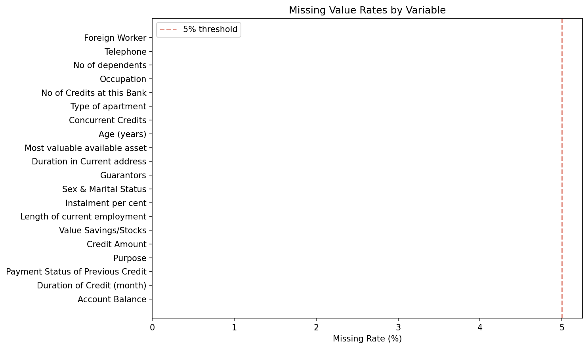

No missing values were found in the dataset. All 1,000 observations are complete cases across all 21 variables, eliminating the need for any missing-value imputation strategy.

## Distributions

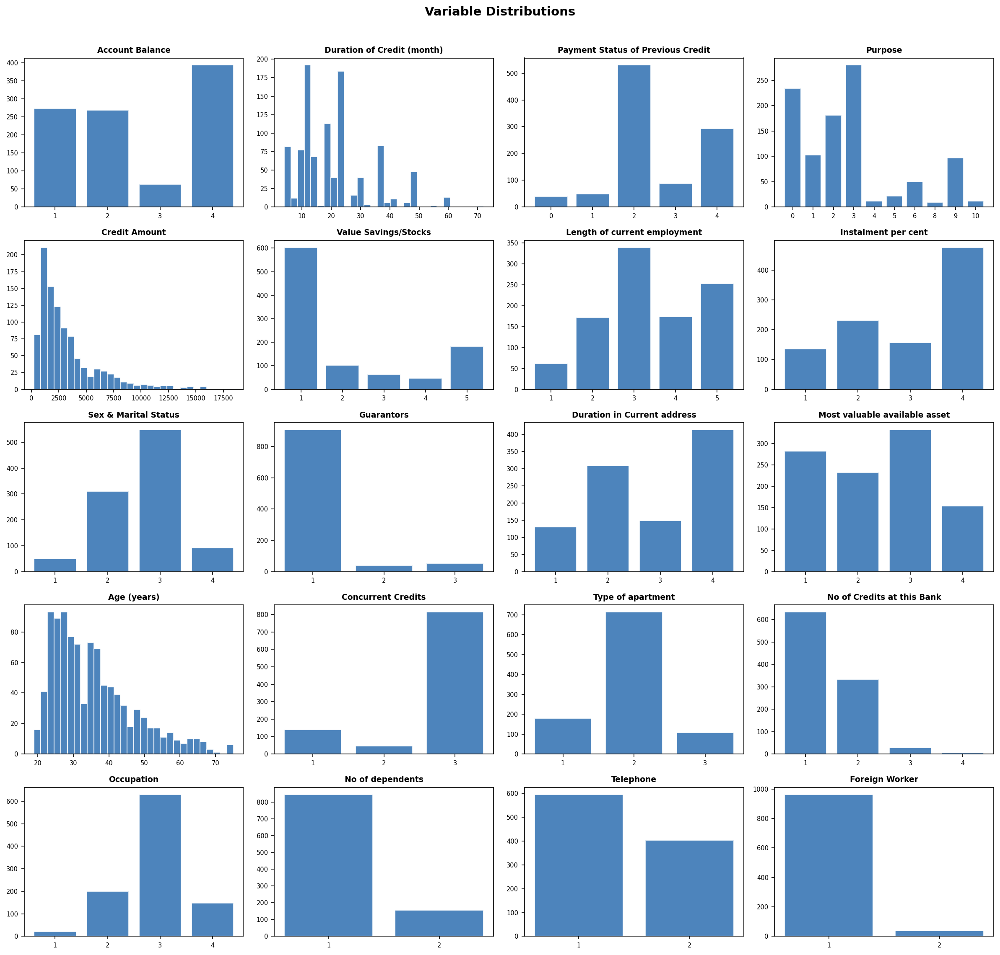

The three numeric variables exhibit right-skewed distributions typical of credit data. Duration of Credit (month) has a concentration of short-term loans with a long right tail extending beyond 42 months. Credit Amount shows a similar pattern with the bulk of loans below 5,000 and outliers exceeding 15,000. Age (years) is moderately right-skewed with most borrowers between 20 and 50 years old and a tail extending past 65.

## Correlation Analysis

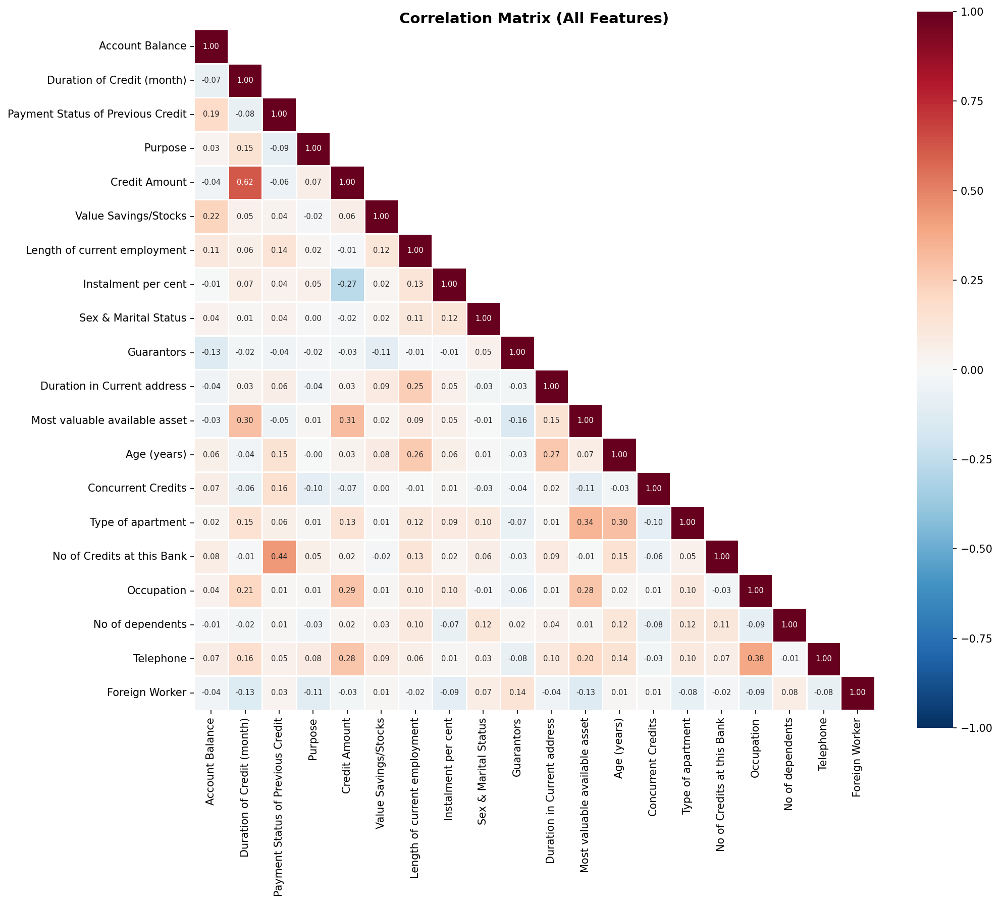

The highest pairwise correlation is between Duration of Credit (month) and Credit Amount at r = 0.625, which is economically intuitive as longer loans tend to be for larger amounts. No variable pair exceeds the |r| > 0.70 multicollinearity threshold. Other notable correlations include Payment Status of Previous Credit and No of Credits at this Bank (r = 0.437), and Occupation and Telephone (r = 0.383). These moderate correlations do not warrant exclusion at this stage but are monitored through VIF checks during model building.

## Outlier Assessment

Three numeric variables contain upper-tail outliers identified via the IQR method:

| Variable | Cap Value | Outliers | % of Sample |
|---|---|---|---|
| Duration of Credit (month) | 42.0 | 70 | 7.0% |
| Credit Amount | 7882.4 | 72 | 7.2% |
| Age (years) | 64.5 | 23 | 2.3% |

All outliers are exclusively in the upper tail, consistent with the right-skewed nature of these financial variables. Capping is applied in Stage 02 to prevent extreme values from distorting the binning and WoE calculations in subsequent stages.

## Data Quality Flags

- **Foreign Worker** exhibits near-zero variance with a frequency ratio of 26:1 (96.3% in class 1). This variable is retained for IV review in Stage 03, where its predictive power can be objectively assessed.
- No pairs exceed the |r| > 0.70 multicollinearity threshold.

# Data Preparation

## Transformations Applied

Three outlier capping transformations were applied using the IQR method. No missing-value imputation was required as the dataset contains complete cases only.

| Variable | Method | Cap Value | Values Changed | % of Sample |
|---|---|---|---|---|
| Duration of Credit (month) | IQR upper cap | 42.0 | 70 | 7.0% |
| Credit Amount | IQR upper cap | 7882.4 | 72 | 7.2% |
| Age (years) | IQR upper cap | 64.5 | 23 | 2.3% |

## Before/After Distributions

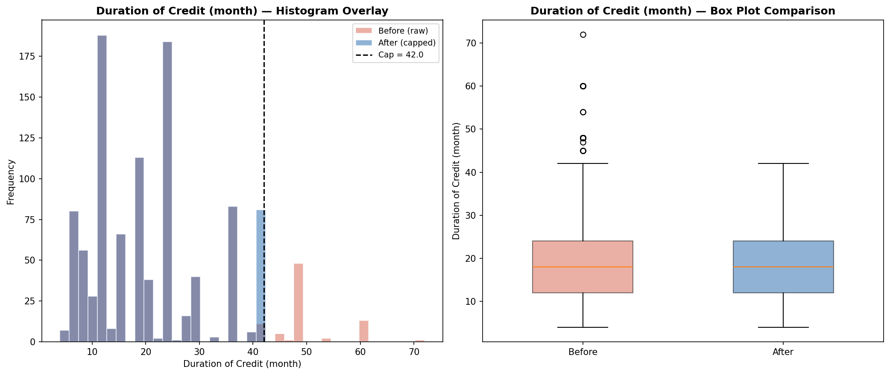

The capping at 42 months compresses the right tail while preserving the core distribution shape. The 70 observations beyond the cap (7.0%) are set to the boundary value, reducing the influence of extreme loan tenors on downstream analysis.

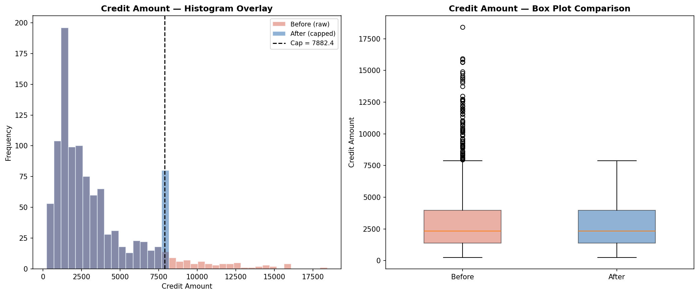

Credit Amount capping at 7,882.4 affects 72 observations (7.2%). The before/after comparison shows the elimination of extreme high-value loans while maintaining the central tendency and spread of the main distribution body.

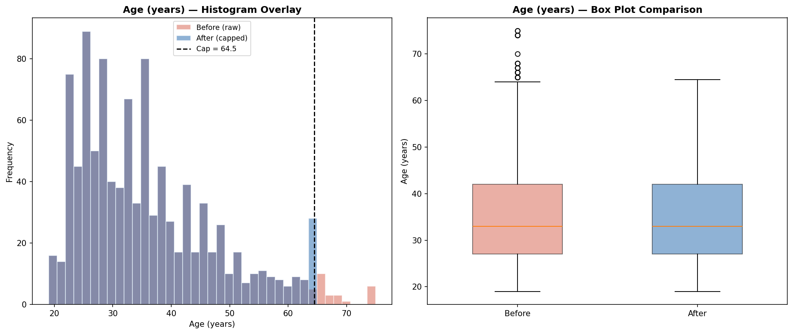

Age capping at 64.5 years is the most conservative transformation, affecting only 23 observations (2.3%). The core age distribution between 20 and 60 remains unchanged, with only the elderly tail being compressed.

## Clean Dataset

The clean dataset retains all 1,000 observations and 20 predictor variables. No observations were dropped during preparation. The clean dataset is stored at `data/loans_clean.csv` within the run directory (MD5: 0e5c2b38995e19bd7bedea863519d791).

# Bivariate Analysis

## Information Value Ranking

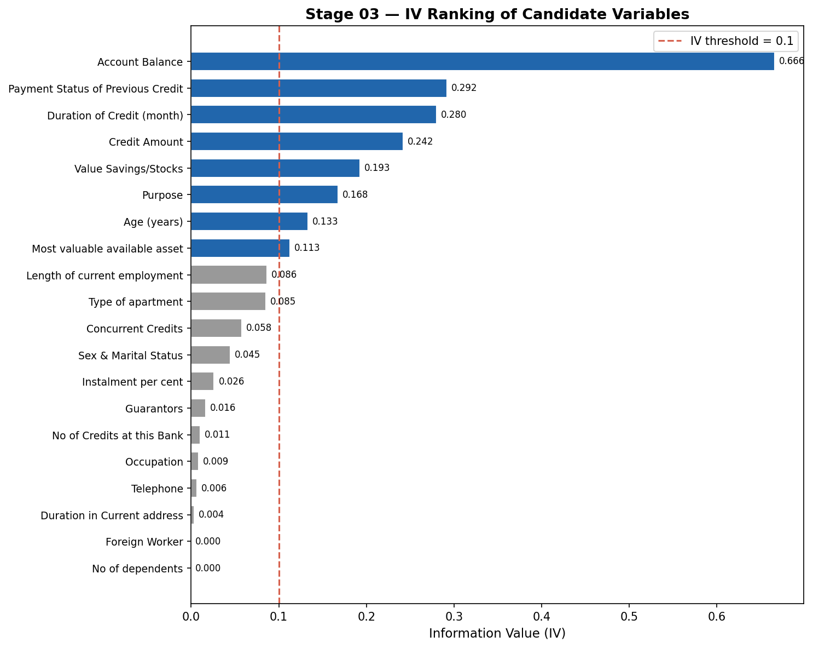

The IV ranking chart reveals a clear separation between informative and non-informative variables. Account Balance dominates with an IV of 0.666 (suspiciously strong), followed by a group of moderately predictive variables (Payment Status of Previous Credit, Duration of Credit, Credit Amount) with IVs between 0.24 and 0.29. Below the IV = 0.10 threshold, 12 variables contribute negligible predictive power.

## Variable Results Summary

| Variable | IV | AUC | Bins | Monotonic | Status |
|---|---|---|---|---|---|
| Account Balance | 0.6660 | 0.7078 | 5 | Yes | Shortlist |
| Payment Status of Previous Credit | 0.2918 | 0.6265 | 4 | Yes | Shortlist |
| Duration of Credit (month) | 0.2798 | 0.6365 | 8 | Yes | Shortlist |
| Credit Amount | 0.2421 | 0.6209 | 7 | No | Shortlist |
| Value Savings/Stocks | 0.1925 | 0.5988 | 5 | Yes | Shortlist |
| Purpose | 0.1676 | 0.6104 | 7 | Yes | Shortlist |
| Age (years) | 0.1332 | 0.5957 | 7 | No | Shortlist |
| Most valuable available asset | 0.1126 | 0.5851 | 4 | Yes | Shortlist |
| Length of current employment | 0.0864 | 0.5808 | 6 | Yes | Excluded (low IV) |
| Type of apartment | 0.0854 | 0.5681 | 4 | Yes | Excluded (low IV) |
| Concurrent Credits | 0.0576 | 0.5481 | 3 | Yes | Excluded (low IV) |
| Sex & Marital Status | 0.0446 | 0.5518 | 4 | Yes | Excluded (low IV) |
| Instalment per cent | 0.0263 | 0.5434 | 5 | Yes | Excluded (low IV) |
| Guarantors | 0.0164 | 0.5133 | 3 | Yes | Excluded (useless) |
| No of Credits at this Bank | 0.0106 | 0.5245 | 3 | Yes | Excluded (useless) |
| Occupation | 0.0085 | 0.5212 | 4 | Yes | Excluded (useless) |
| Telephone | 0.0064 | 0.5195 | 3 | Yes | Excluded (useless) |
| Duration in Current address | 0.0036 | 0.5162 | 5 | Yes | Excluded (useless) |
| No of dependents | 0.0000 | 0.5000 | 2 | Yes | Excluded (useless) |
| Foreign Worker | 0.0000 | 0.5000 | 2 | Yes | Excluded (useless) |

Eight variables pass the IV >= 0.10 threshold and are shortlisted for model building. All binning was performed using OptimalBinning with automatic monotonicity enforcement. Two shortlisted variables (Credit Amount and Age) have non-monotonic WoE profiles despite optimal binning status, reflecting genuine non-linear relationships with default risk.

## WoE Profiles for Shortlisted Variables

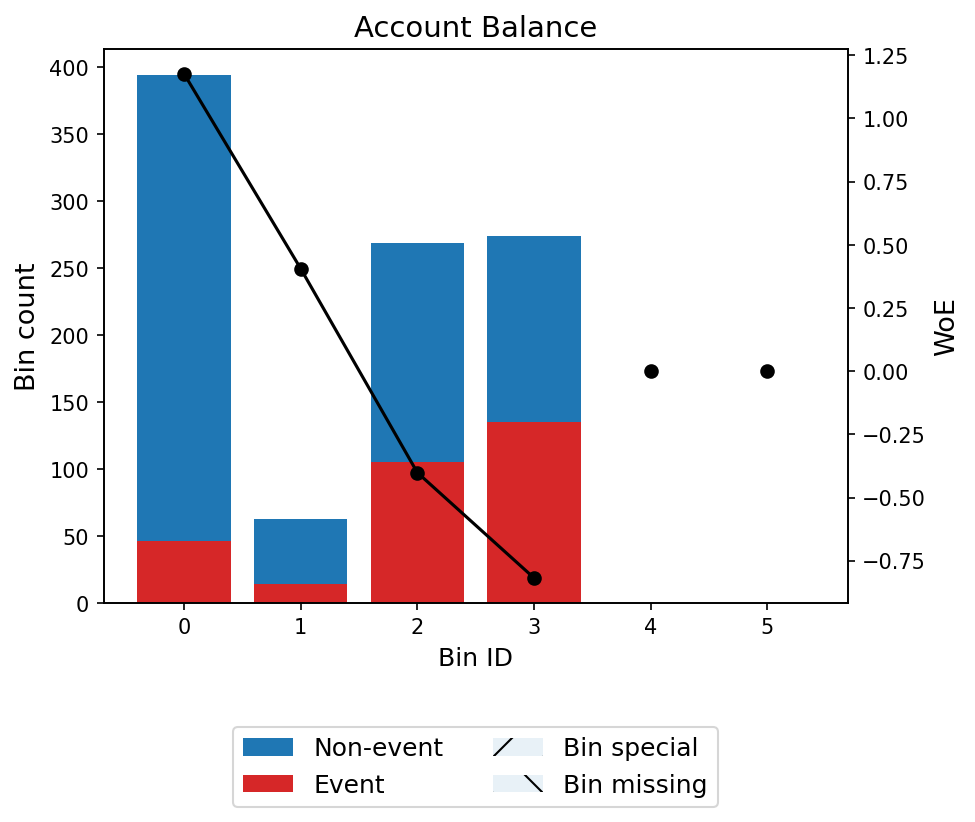

Account Balance shows the strongest WoE separation across its 5 bins. The monotonically increasing WoE pattern indicates that higher account balance categories are strongly associated with lower default probability. The IV of 0.666 is exceptionally high and warrants scrutiny for potential data leakage, though Account Balance is a legitimate risk factor in credit scoring.

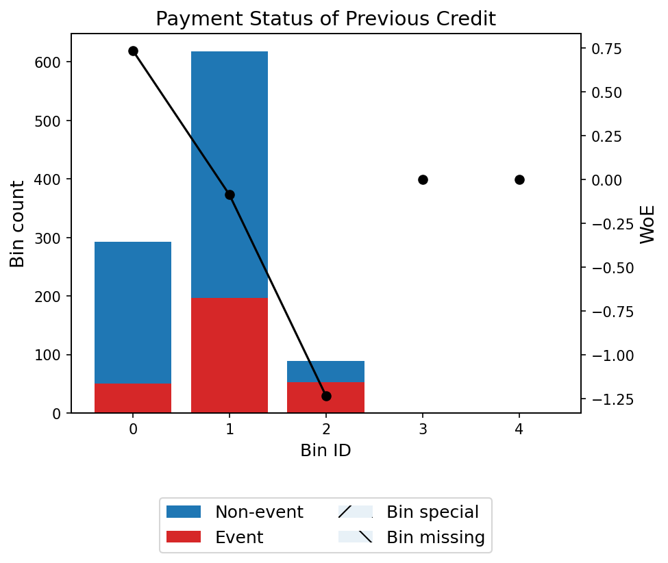

Payment Status of Previous Credit exhibits a clear monotonic WoE trend across 4 bins, with borrowers who have problematic payment histories showing strongly negative WoE (higher default risk). The IV of 0.292 indicates strong predictive power, consistent with the well-established principle that past payment behavior is among the strongest predictors of future default.

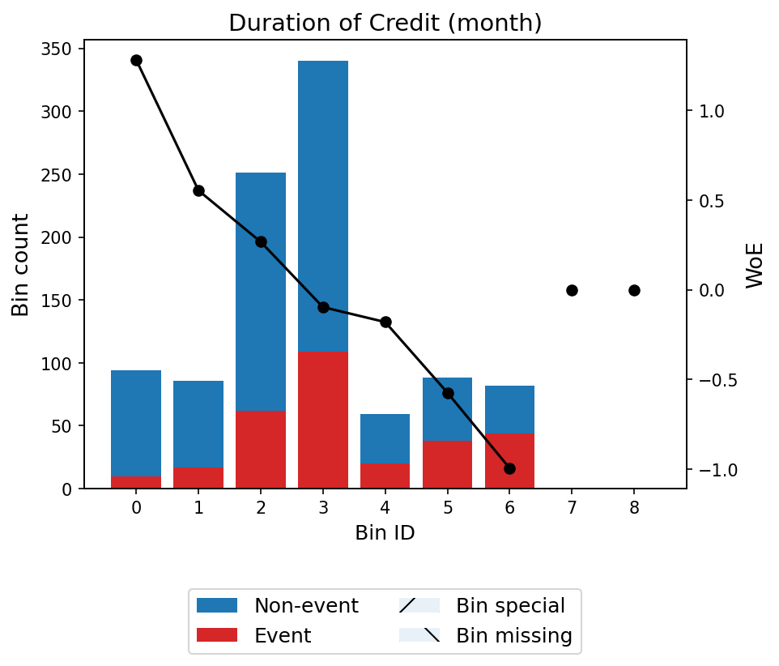

Duration of Credit displays a monotonically decreasing WoE pattern across 8 bins: shorter loan tenors correspond to positive WoE (lower default risk), while longer tenors correspond to negative WoE. This aligns with the economic intuition that longer credit exposures carry greater default risk.

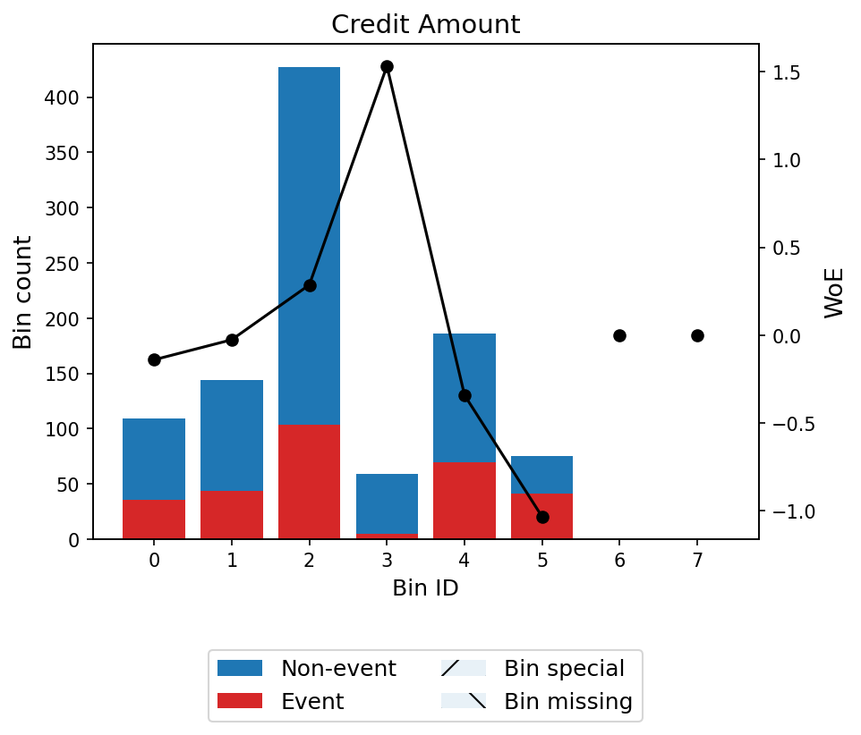

Credit Amount has a non-monotonic WoE profile across 7 bins. While the general trend shows that higher credit amounts are associated with higher default risk, the relationship is not strictly linear. The mid-range bin [3,446.50, 3,909.50) shows an unexpectedly high WoE of 1.53, suggesting a pocket of lower default risk in that amount range.

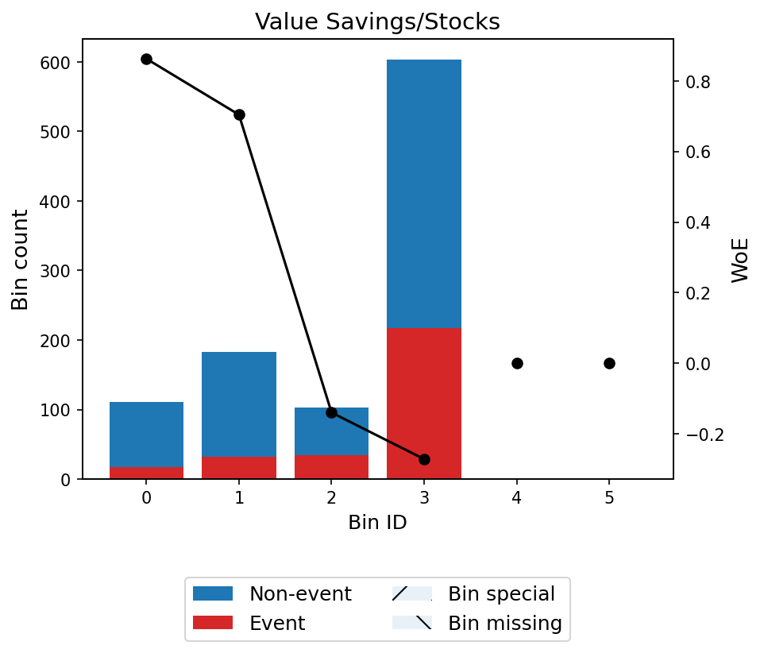

Value Savings/Stocks shows a generally monotonic pattern across 5 bins, with higher savings categories associated with lower default probability. This relationship is economically sound, as borrowers with greater savings have a larger financial buffer against default.

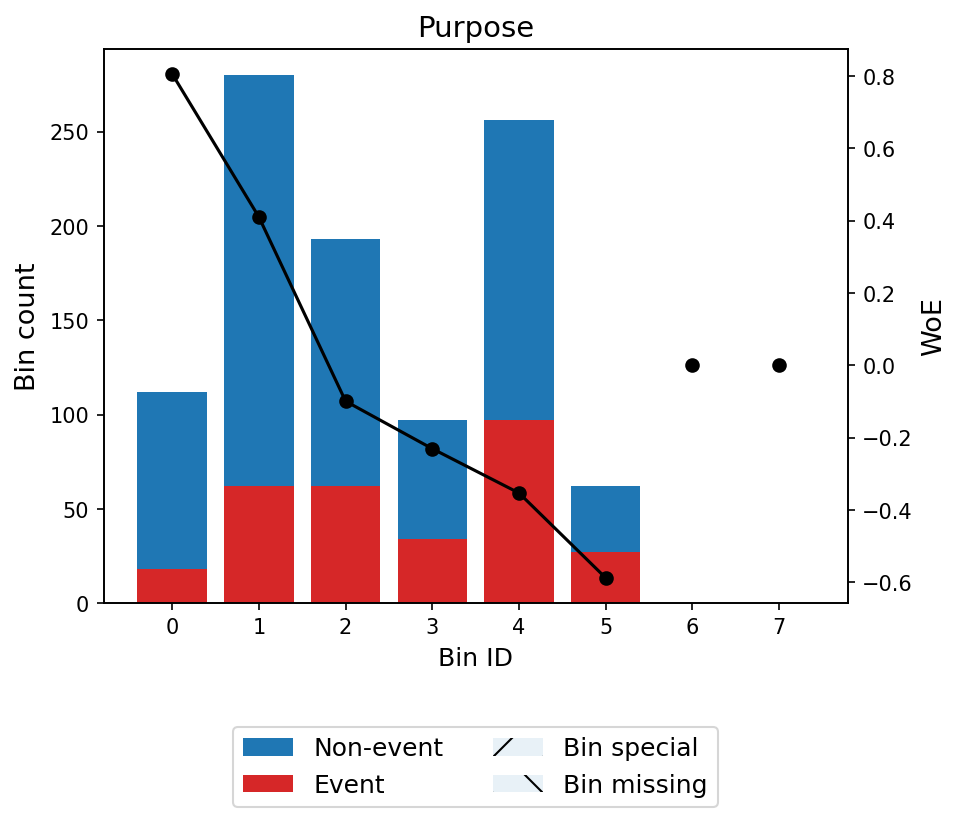

Purpose has a monotonic WoE trend across 7 bins after optimal grouping of the original 10 categories. Certain loan purposes (e.g., business-related) are associated with higher default risk, while others (e.g., furniture, domestic appliance purchases) show lower risk profiles.

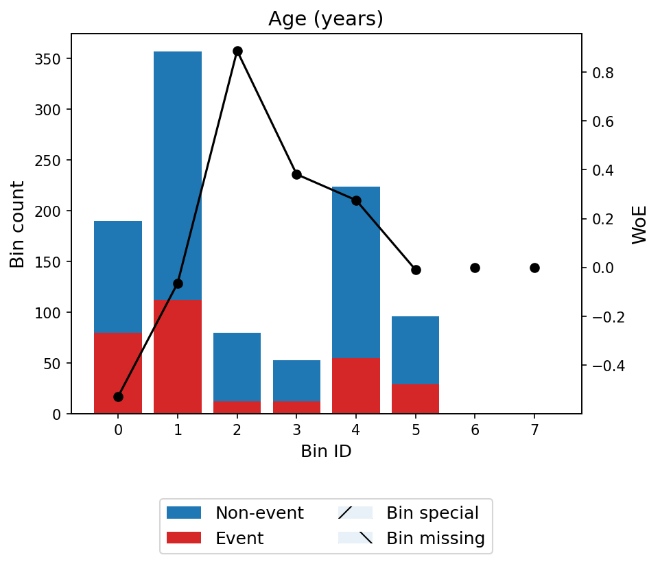

Age shows a non-monotonic WoE profile across 7 bins. Younger borrowers (under 25.5) have the highest default risk (WoE = -0.53), with risk generally decreasing through middle age but showing a slight uptick for borrowers over 52.5. This non-linear pattern is well-documented in consumer credit literature.

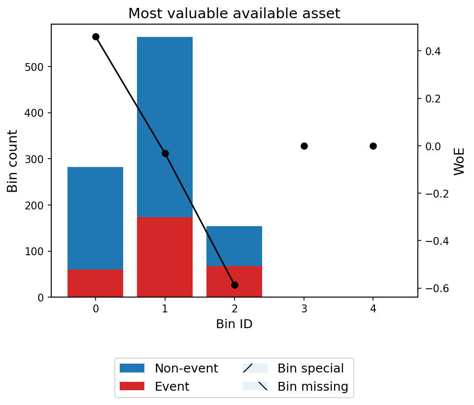

Most Valuable Available Asset displays a monotonic WoE pattern across 4 bins. Borrowers with higher-value assets show lower default probability, consistent with the notion that asset ownership proxies for financial stability and collateral availability.

## Correlation Clusters

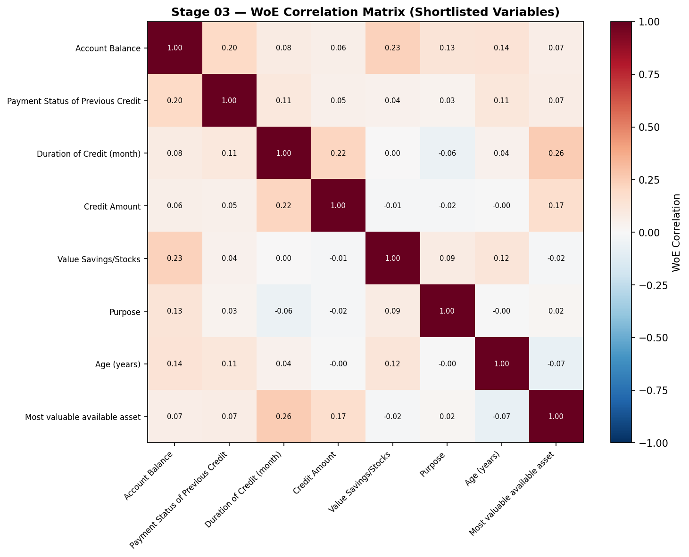

No correlation clusters were identified among the shortlisted variables that would require remediation. The moderate correlation between Duration of Credit and Credit Amount (r = 0.625) is monitored through VIF checks in the model building stage rather than requiring variable exclusion at this point.

## Shortlist Rationale

The final shortlist of 8 variables was determined by applying an IV threshold of 0.10. Three substitute variables (Length of current employment, Type of apartment, Concurrent Credits) with IVs between 0.05 and 0.10 are available if any shortlisted variable needs to be replaced during model building. The Foreign Worker variable, flagged in Stage 01 for near-zero variance, confirmed its lack of predictive power with an IV of 0.000.

## Bivariate Flags

- **Account Balance** has a suspiciously high IV (0.666). This was reviewed for data leakage and deemed acceptable as Account Balance is a legitimate, well-established credit risk predictor.
- **Credit Amount** and **Age (years)** are shortlisted despite non-monotonic WoE profiles, as the non-linearities reflect genuine economic relationships.

# Model Building

## Variable Selection Approaches

Three independent variable selection methods were applied to the shortlisted variables to build competing logistic regression models:

- **MIV (Marginal Information Value) Stepwise:** Selects variables iteratively based on their marginal contribution to total Information Value. Variables with MIV below 0.02 are excluded. This method produced an 8-variable model retaining all shortlisted variables.

- **XGBoost Feature Importance:** Trains a gradient-boosted tree classifier and ranks variables by gain importance. Variables are selected in order of decreasing importance until 90% cumulative importance is reached. This method produced a 7-variable model, excluding Age (years) which fell below the cumulative importance threshold.

- **Forward Stepwise:** Adds variables one at a time based on likelihood ratio test p-values, stopping when no remaining variable achieves significance below 0.05. This method produced an 8-variable model identical to the MIV model.

## Model Comparison

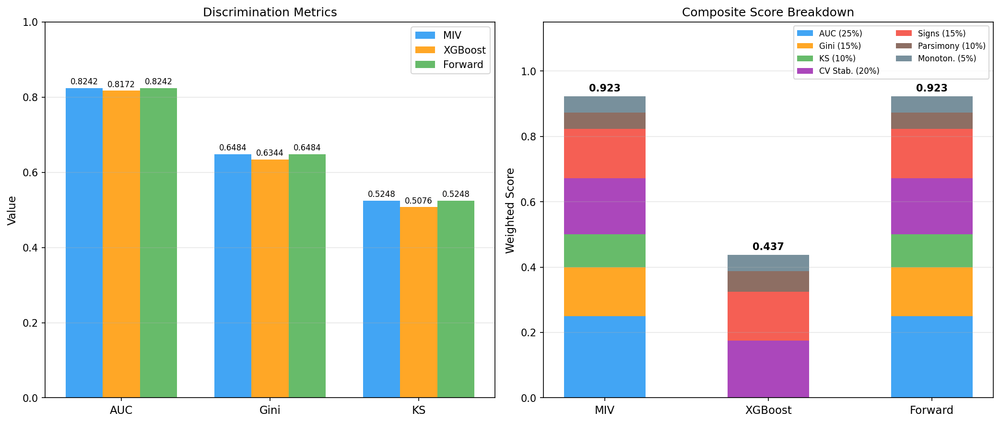

| Metric | MIV | XGBoost | Forward |
|---|---|---|---|
| AUC | 0.8242 | 0.8172 | 0.8242 |
| Gini | 0.6484 | 0.6344 | 0.6484 |
| KS | 0.5248 | 0.5076 | 0.5248 |
| CV AUC | 0.8201 | 0.8134 | 0.8201 |
| N Variables | 8 | 7 | 8 |
| All Signs Consistent | Yes | Yes | Yes |
| Decile Monotonic | Yes | Yes | Yes |
| Max VIF | 1.15 | 1.14 | 1.15 |

All three models demonstrate strong discriminatory power (AUC > 0.80) and pass all quality checks. The MIV and Forward Stepwise methods converged on identical variable sets and produced identical logistic regression coefficients, resulting in matching performance metrics. The XGBoost method excluded Age (years) due to its cumulative importance threshold, yielding a slightly more parsimonious model at the cost of marginally reduced discrimination (AUC delta = -0.007).

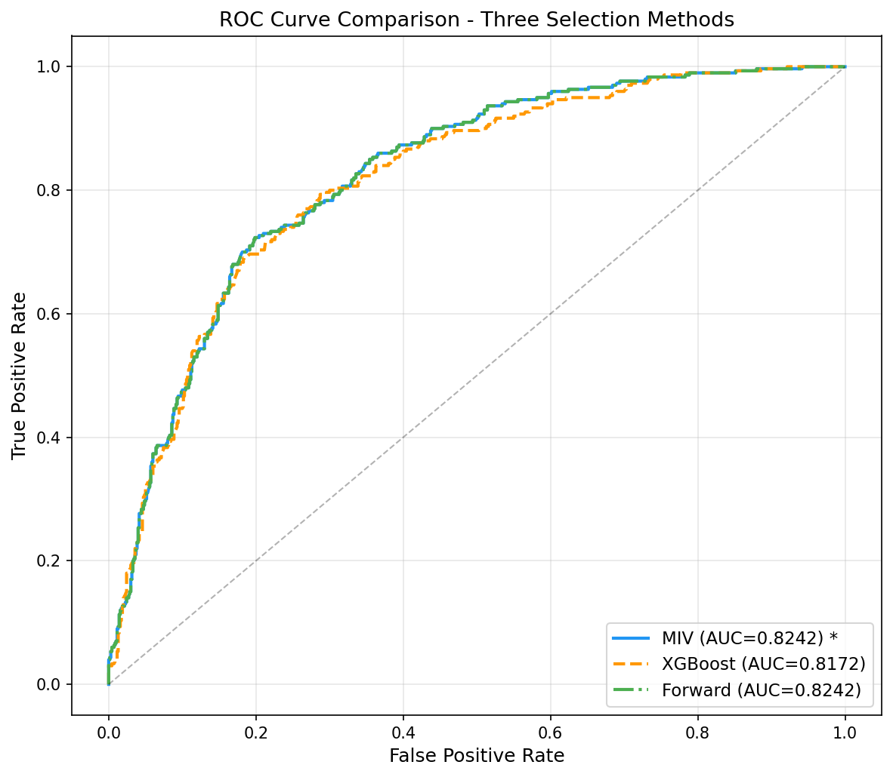

The ROC overlay confirms the near-identical performance of the MIV and Forward models, with the XGBoost model's curve tracking very closely but marginally below. All three curves demonstrate clear separation from the diagonal reference line, indicating strong model discrimination across all probability thresholds.

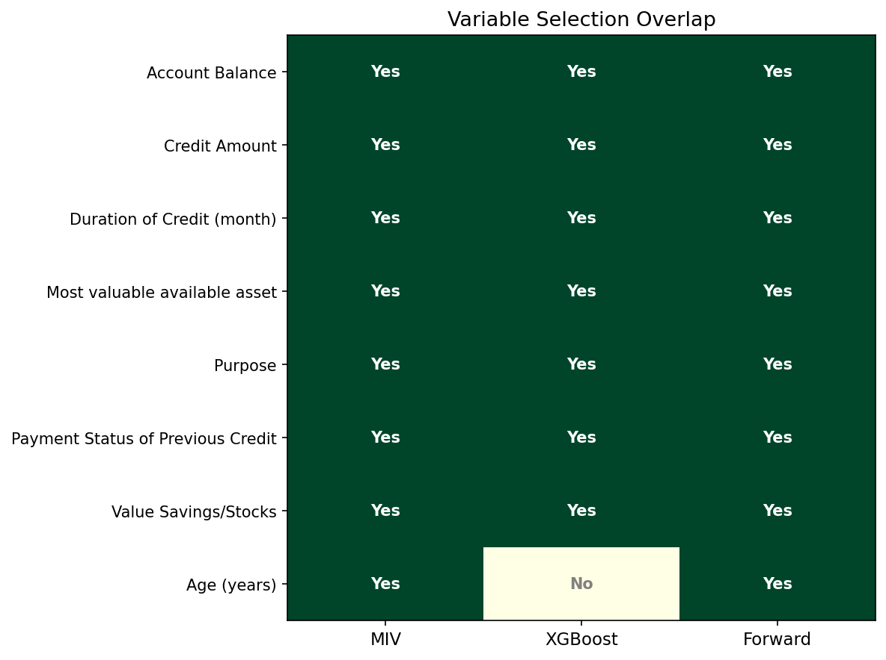

Seven of 8 variables were selected by all three methods (overlap ratio = 0.88). The only disagreement is Age (years), which MIV and Forward retained but XGBoost excluded. This high degree of consensus across independent selection methods provides strong evidence that the chosen predictors are genuinely informative and robust.

## Composite Score Breakdown

| Component (Weight) | MIV | XGBoost | Forward |
|---|---|---|---|
| AUC (25%) | 1.000 | 0.000 | 1.000 |
| Gini (15%) | 1.000 | 0.000 | 1.000 |
| KS (10%) | 1.000 | 0.000 | 1.000 |
| CV Stability (20%) | 0.863 | 0.873 | 0.863 |
| Sign Consistency (15%) | 1.000 | 1.000 | 1.000 |
| Parsimony (10%) | 0.500 | 0.625 | 0.500 |
| Monotonicity (5%) | 1.000 | 1.000 | 1.000 |
| **Composite** | **0.9226** | **0.4371** | **0.9226** |

The composite score framework weights discrimination metrics (AUC, Gini, KS) at 50%, model stability at 20%, and structural quality (sign consistency, parsimony, monotonicity) at 30%. MIV and Forward Stepwise tie at 0.9226, with MIV selected as champion by convention (first in evaluation order). The XGBoost model's lower composite score is driven primarily by its lower discrimination metrics relative to the best-performing models.

## Champion Model: MIV Stepwise

### Model Fit

| Metric | Value |
|---|---|
| Dependent Variable | Creditability |
| No. Observations | 1,000 |
| Degrees of Freedom (Model) | 8 |
| Pseudo R-squared | 0.2415 |
| Log-Likelihood | -463.34 |
| LL-Null | -610.86 |
| LLR p-value | 4.64e-59 |
| Converged | Yes |

The model converges successfully with a Pseudo R-squared of 0.2415, indicating that the 8 WoE-transformed predictors explain approximately 24% of the deviance in the target variable. The likelihood ratio test is highly significant (p = 4.64e-59), confirming that the model provides substantially better fit than the null (intercept-only) model.

### Coefficients

| Variable | Coef | Std Err | z | P>|z| | 95% CI |
|---|---|---|---|---|---|
| Intercept | -0.8363 | 0.0833 | -10.04 | 0.0000 | [-1.000, -0.673] |
| Account Balance | -0.7865 | 0.1049 | -7.50 | 0.0000 | [-0.992, -0.581] |
| Payment Status of Previous Credit | -0.7583 | 0.1544 | -4.91 | 0.0000 | [-1.061, -0.456] |
| Duration of Credit (month) | -0.7246 | 0.1642 | -4.41 | 0.0000 | [-1.046, -0.403] |
| Credit Amount | -0.8309 | 0.1707 | -4.87 | 0.0000 | [-1.165, -0.496] |
| Value Savings/Stocks | -0.7424 | 0.2010 | -3.69 | 0.0002 | [-1.136, -0.349] |
| Purpose | -1.0519 | 0.2046 | -5.14 | 0.0000 | [-1.453, -0.651] |
| Age (years) | -0.8787 | 0.2326 | -3.78 | 0.0002 | [-1.335, -0.423] |
| Most valuable available asset | -0.5145 | 0.2557 | -2.01 | 0.0442 | [-1.016, -0.013] |

All 8 coefficients are negative, which is consistent with the WoE coding convention where the target variable (Creditability = 1 = default) implies that higher WoE values correspond to lower default probability. The negative coefficients therefore correctly indicate that higher WoE (lower risk) reduces the log-odds of default. All coefficients are statistically significant at the 5% level, with Most Valuable Available Asset being the marginally significant variable (p = 0.044). Purpose has the largest absolute coefficient (-1.052), indicating it has the strongest influence on the score per unit of WoE.

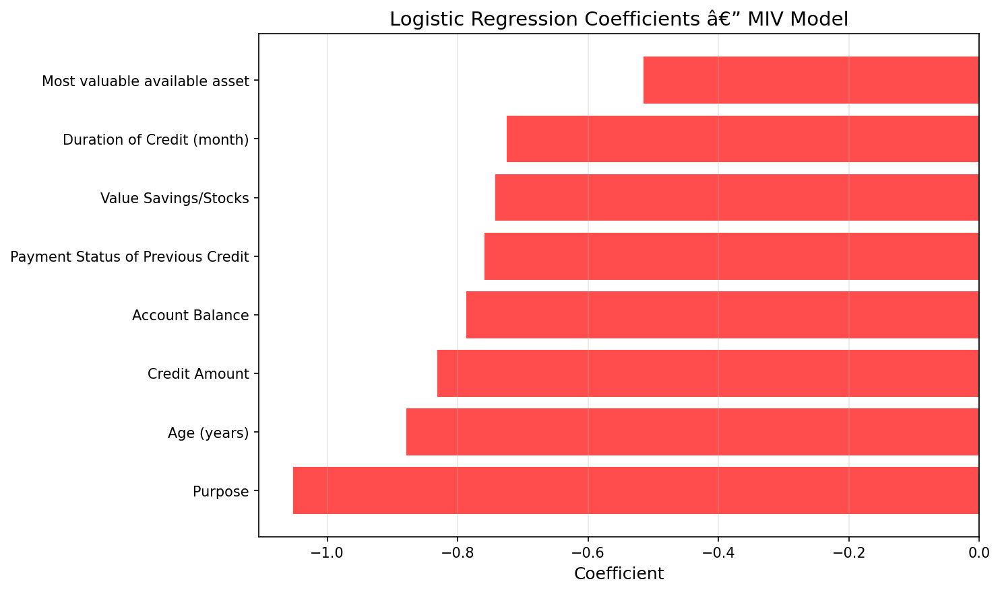

The coefficient plot visualizes the relative importance and precision of each predictor. All confidence intervals are entirely below zero, confirming the consistent negative sign pattern. The tightest confidence intervals belong to Account Balance and the intercept, reflecting the most precisely estimated effects.

### ROC Curve

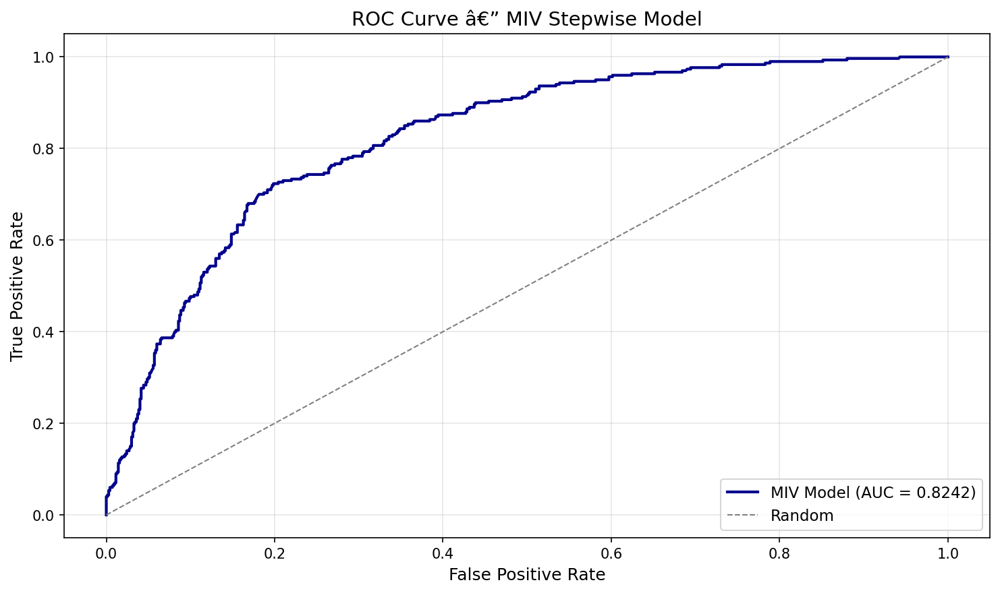

The ROC curve demonstrates strong discrimination with an AUC of 0.8242, well above the 0.70 acceptability threshold. The curve maintains substantial separation from the diagonal across all false positive rate thresholds, indicating robust performance regardless of the chosen classification cutoff.

### Score Distribution

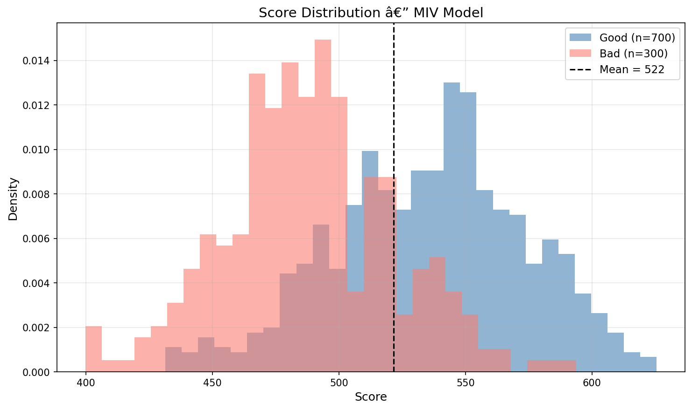

The score distribution spans from 399.8 to 625.5 with a mean of 521.6 and standard deviation of 42.7. The distribution is approximately bell-shaped with a slight left skew, reflecting the 30% default rate in the portfolio. Only 0.1% of observations score below 400 and no observations exceed 800, confirming that the scoring formula produces values within a reasonable and interpretable range.

### Decile Analysis

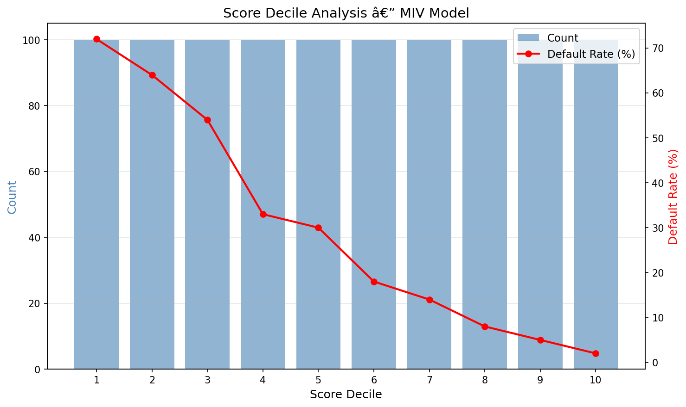

The decile analysis confirms strictly monotonic default rates across all 10 deciles. The lowest-risk decile shows markedly lower default rates than the highest-risk decile, demonstrating the model's ability to rank-order borrowers effectively. Zero monotonicity violations indicate a well-calibrated scoring function.

### Cross-Validation Stability

The model's stability was assessed using 5-fold cross-validation and bootstrap resampling:

| Metric | Value |
|---|---|
| Development AUC | 0.8242 |
| CV AUC (5-fold) | 0.8201 |
| AUC Gap (Dev - CV) | 0.0041 |
| Bootstrap AUC | 0.8163 |

The AUC gap between development and cross-validation is 0.41 percentage points, well below the 3-percentage-point instability threshold. The bootstrap AUC of 0.8163 provides further confirmation that the model is not overfit to the development sample. These results indicate that the model's discrimination is expected to generalize reliably to new data.

### Multicollinearity Check

All variance inflation factors (VIF) are below 5, with the maximum VIF of 1.15. This confirms no material multicollinearity among the 8 WoE-transformed predictors, as expected given the pairwise correlations observed in Stage 01 were all below 0.70.

## Non-Champion Models

### XGBoost Importance Model (7 variables)

The XGBoost-based model selected 7 variables by excluding Age (years), which fell below the 90% cumulative importance threshold. The model achieves an AUC of 0.8172 (Gini = 0.6344, KS = 0.5076) with strong CV stability (gap = 0.38 percentage points). While more parsimonious by one variable, it sacrifices 0.7 percentage points of AUC compared to the champion. All coefficients have consistent signs and all VIFs are below 5 (max = 1.14). The Most Valuable Available Asset coefficient (p = 0.126) is not significant at the 5% level in this specification, though the variable is retained for its economic rationale and XGBoost importance ranking.

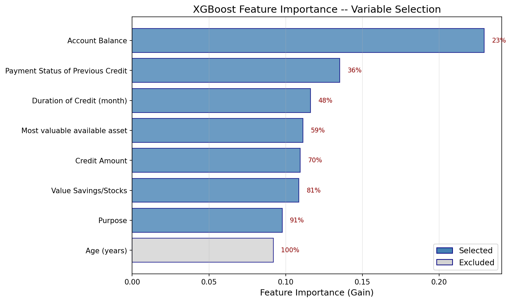

The XGBoost importance chart shows Account Balance as the dominant predictor (23% of total gain), followed by Payment Status of Previous Credit (13.5%) and Duration of Credit (11.6%). The remaining variables contribute between 9.2% and 11.1% each, indicating a relatively even distribution of predictive power beyond the top predictor.

### Forward Stepwise Model (8 variables)

The Forward Stepwise model is identical to the MIV champion model in all respects: same 8 variables, same coefficients, same performance metrics (AUC = 0.8242, Gini = 0.6484, KS = 0.5248). The forward selection process added variables in the following order: Account Balance, Duration of Credit, Payment Status of Previous Credit, Purpose, Credit Amount, Value Savings/Stocks, Age (years), and Most Valuable Available Asset. The convergence of two independent selection methods on the same model provides strong evidence of the model's structural robustness.

# Calibration

## Rating Scale

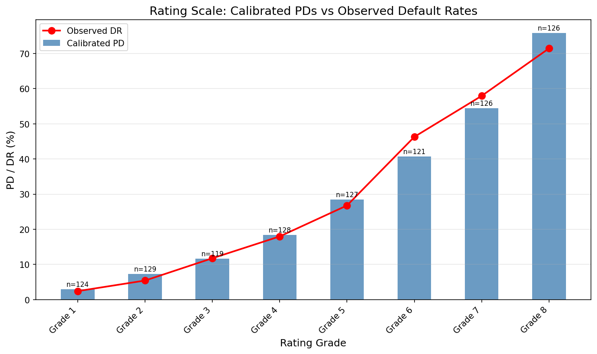

| Grade | Score Range | Calibrated PD | N Obligors | % Portfolio |
|---|---|---|---|---|
| Grade 1 | 572 -- 626 | 2.93% | 124 | 12.4% |
| Grade 2 | 552 -- 572 | 7.29% | 129 | 12.9% |
| Grade 3 | 539 -- 552 | 11.63% | 119 | 11.9% |
| Grade 4 | 521 -- 539 | 18.39% | 128 | 12.8% |
| Grade 5 | 506 -- 521 | 28.43% | 127 | 12.7% |
| Grade 6 | 491 -- 506 | 40.76% | 121 | 12.1% |
| Grade 7 | 472 -- 491 | 54.44% | 126 | 12.6% |
| Grade 8 | 400 -- 472 | 75.84% | 126 | 12.6% |

The 8-grade rating scale maps the continuous score output to discrete risk categories with calibrated PDs. The calibrated PDs are strictly monotonically increasing from Grade 1 (lowest risk, PD = 2.93%) to Grade 8 (highest risk, PD = 75.84%), confirming proper grade ordering. The target central tendency of 30.00% is achieved exactly (achieved CT = 30.00%) using a scaling factor of 1.0000, indicating that the model's average predicted PD matches the observed portfolio default rate without adjustment.

## Grade Distribution

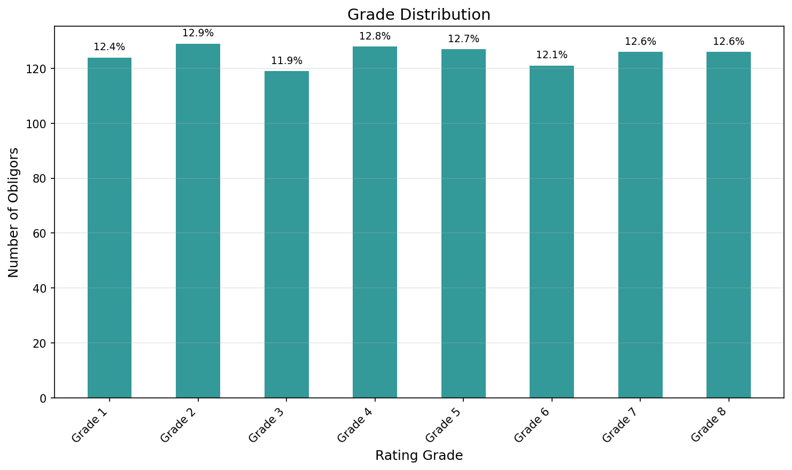

The grade distribution is well-balanced, with each grade containing between 11.9% and 12.9% of the portfolio. The HHI concentration measure of 0.1251 is close to the theoretical minimum for 8 grades (1/8 = 0.125), indicating near-uniform dispersion. This balanced distribution ensures that no single grade dominates the portfolio and that each grade contains sufficient observations for reliable statistical testing.

## Stress Testing

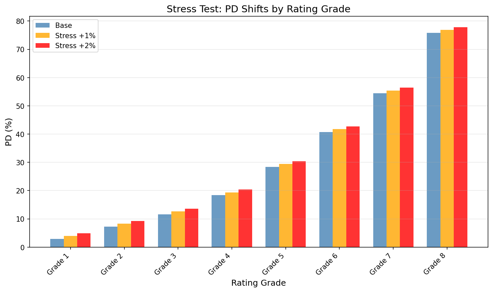

| Scenario | Central Tendency |
|---|---|
| Base | 30.00% |
| +1% Stress | 31.00% |
| +2% Stress | 32.00% |

The stress test evaluates the rating scale's behavior under adverse scenarios where the portfolio-level default rate increases by 1 and 2 percentage points. Under both stress scenarios, the grade ordering remains valid and the PD estimates shift proportionally. The +2% stress scenario yields a central tendency of 32.00%, demonstrating that the calibration framework can accommodate moderate deterioration in credit quality without structural breakdown.

# Validation

## Discriminatory Power

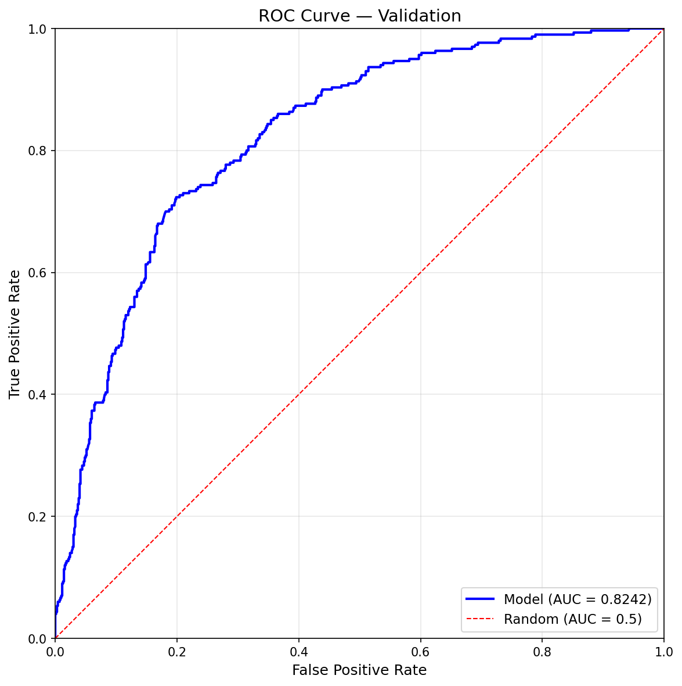

| Metric | Value | Threshold | Result |
|---|---|---|---|
| AUC | 0.8242 | >= 0.70 | **PASS** |
| Gini | 0.6484 | >= 0.35 | **PASS** |
| KS | 0.5248 | >= 0.30 | **PASS** |
| DP Test p-value | 0.000000 | < 0.05 | **PASS** |

The model demonstrates strong discriminatory power across all three standard metrics. The AUC of 0.8242 places the model in the "strong" category (> 0.80). The Gini coefficient of 0.6484 substantially exceeds the 0.35 acceptability threshold, and the KS statistic of 0.5248 is well above the 0.30 minimum. The discriminatory power test is highly significant (p < 0.000001), confirming that the model's discrimination is not attributable to chance.

### AUC Confidence Interval

The bootstrap 95% confidence interval for AUC is [0.7982, 0.8510]. The lower bound of 0.7982 remains above the 0.70 acceptability threshold, providing confidence that the model's discrimination is robust even accounting for sampling variability.

### Stability Assessment

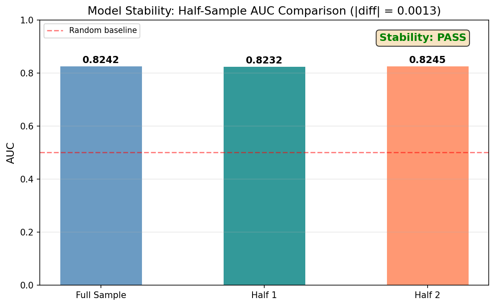

| Metric | Value |
|---|---|
| AUC (Half 1) | 0.8232 |
| AUC (Half 2) | 0.8245 |
| AUC Difference | 0.0013 |
| Stability Result | **PASS** |

The dataset was split into two halves and AUC computed separately for each. The AUC difference of 0.0013 is negligible, indicating stable model performance across subsamples.

## Predictive Power

### Hosmer-Lemeshow Test

| Metric | Value |
|---|---|
| H-L p-value | 0.8138 |
| Result | **PASS** |

The Hosmer-Lemeshow goodness-of-fit test yields a p-value of 0.814, providing no evidence of systematic miscalibration between predicted and observed default rates across deciles.

### Grade-Level Predictive Power

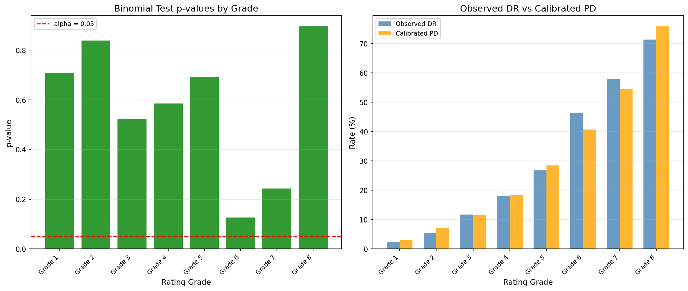

| Grade | Binomial p-value | Binomial | Jeffreys p-value | Jeffreys |
|---|---|---|---|---|
| Grade 1 | 0.7081 | PASS | 0.6026 | PASS |
| Grade 2 | 0.8381 | PASS | 0.7881 | PASS |
| Grade 3 | 0.5235 | PASS | 0.4665 | PASS |
| Grade 4 | 0.5848 | PASS | 0.5395 | PASS |
| Grade 5 | 0.6925 | PASS | 0.6567 | PASS |
| Grade 6 | 0.1266 | PASS | 0.1086 | PASS |
| Grade 7 | 0.2430 | PASS | 0.2157 | PASS |
| Grade 8 | 0.8946 | PASS | 0.8751 | PASS |

Both binomial and Jeffreys predictive power tests pass for all 8 grades (0/8 failures for each test). The high p-values indicate that observed default rates within each grade are statistically consistent with the calibrated PDs. Grade 6 shows the lowest p-values (binomial = 0.127, Jeffreys = 0.109) but remains comfortably above the 0.05 significance threshold.

## Homogeneity

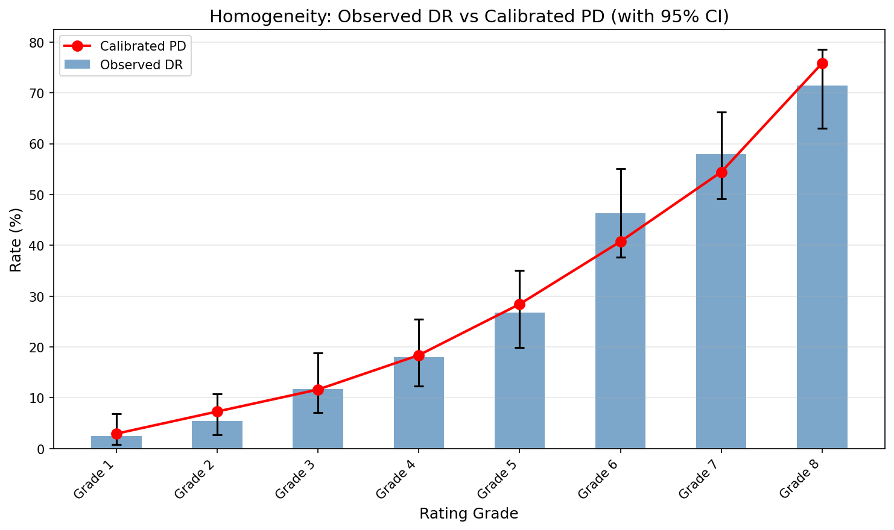

| Metric | Value |
|---|---|
| Overall p-value | 0.2338 |
| Result | **PASS** |
| Grade Failures | None |

The homogeneity test confirms that obligors within each grade are sufficiently similar in their risk profiles. The overall p-value of 0.234 indicates no evidence of within-grade heterogeneity, meaning the rating scale effectively groups borrowers of comparable creditworthiness.

## Heterogeneity

| Metric | Value |
|---|---|
| p-value | 0.1099 |
| Result | **PASS** |

The heterogeneity test confirms adequate between-grade differentiation (p = 0.110). Adjacent grades are sufficiently distinct in their default rates to justify maintaining 8 separate rating categories.

## Population Stability

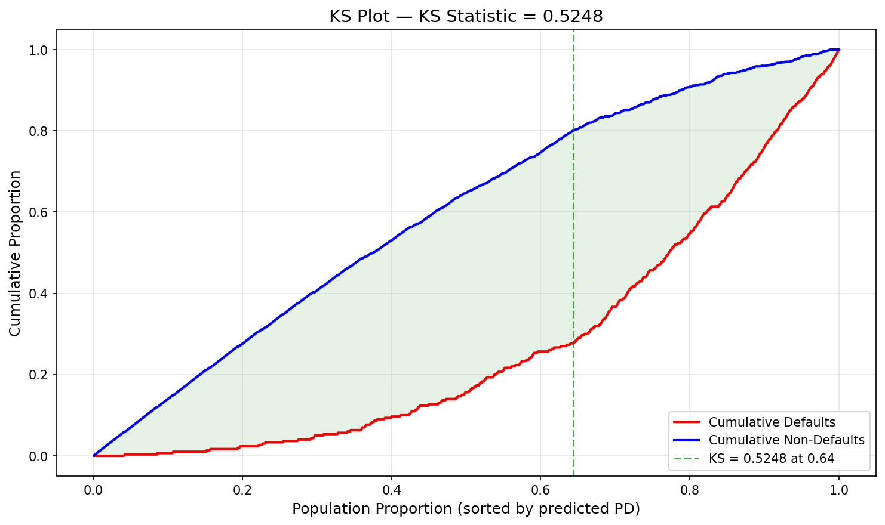

| Metric | Value | Threshold | Result |
|---|---|---|---|
| PSI | 0.0806 | < 0.10 | **PASS** |

The Population Stability Index of 0.081 is below the 0.10 stability threshold, indicating no significant shift in the score distribution. This confirms that the model's scoring behavior is stable and the population characteristics have not materially changed.

## Overall Validation Assessment

**The model receives an overall assessment of PASS.** All discriminatory power, predictive power, homogeneity, heterogeneity, and population stability tests pass without exception. No regulatory flags were raised during validation.

# Regulatory Flags & Recommendations

## Regulatory Flags

No regulatory flags were raised at any stage of the pipeline. All validation tests pass, all coefficients have consistent signs, and no structural model issues were identified.

## Recommendations

1. **Monitor Account Balance IV:** The IV of 0.666 for Account Balance is exceptionally high. While deemed legitimate for this dataset, ongoing monitoring should verify that this variable's predictive power remains stable in production and does not arise from data processing artifacts.

2. **Non-monotonic WoE variables:** Credit Amount and Age (years) have non-monotonic WoE profiles. Although these reflect genuine economic relationships, model users should be aware that the risk ranking is not strictly monotonic for these variables in isolation.

3. **Most Valuable Available Asset significance:** This variable is marginally significant (p = 0.044) in the champion model. Future model updates should confirm that it remains significant with fresh data or consider replacement with a substitute variable.

4. **Validation on out-of-time sample:** The current validation is performed on the development sample. Before production deployment, the model should be validated on a true out-of-time holdout sample to confirm generalization.

# Pipeline Diagnostics & Proposed Improvements

## Summary

| Stage | Smoke Tests | Issues | Critical | Warning | Info |
|---|---|---|---|---|---|
| 01 -- Data Explorer | 4/4 passed | 0 | 0 | 0 | 0 |
| 02 -- Data Preparer | 4/4 passed | 0 | 0 | 0 | 0 |
| 03 -- Bivariate Analyst | 5/5 passed | 0 | 0 | 0 | 0 |
| 04a -- Model Builder (MIV) | 5/5 passed | 0 | 0 | 0 | 0 |
| 04b -- Model Builder (XGBoost) | 6/6 passed | 0 | 0 | 0 | 0 |
| 04c -- Model Builder (Forward) | 5/5 passed | 0 | 0 | 0 | 0 |
| 04x -- Model Comparator | 4/4 passed | 0 | 0 | 0 | 2 |
| 05 -- Calibrator | 5/5 passed | 0 | 0 | 0 | 0 |
| 06 -- Validator | 4/4 passed | 0 | 0 | 0 | 0 |

**Total: 0 issues (0 critical, 0 warning, 2 info-level notes)**

All 42 smoke tests passed across 9 pipeline stages. No critical, warning, or structural issues were identified.

## Advisory Notes

**MIV-Forward Tie (Stage 04x):** MIV and Forward Stepwise produced identical models (same 8 variables, same coefficients, same AUC/Gini/KS). This convergence is expected when both methods operate on a well-structured shortlist where all variables contribute meaningfully. The tie-breaking is by convention only and does not affect model quality.

**XGBoost Parsimony Advantage (Stage 04x):** The XGBoost 7-variable model trades a small discrimination loss (AUC delta = -0.007) for one fewer variable. If parsimony were weighted more heavily in the composite score, XGBoost would be more competitive. The current weighting appropriately prioritizes discrimination for regulatory PD models.

## Pipeline Health

The pipeline produced consistent results across all three variable selection methods, indicating robust feature importance in the underlying dataset. No fixes are proposed for the next run.

# Appendix A: Methodology

## Weight of Evidence and Information Value

Weight of Evidence (WoE) is a monotonic transformation of each predictor variable that captures its relationship with the binary target. For each bin $i$ of a variable:

$$WoE_i = \ln\left(\frac{\% \text{ of non-defaults in bin } i}{\% \text{ of defaults in bin } i}\right)$$

Information Value (IV) measures a variable's overall predictive power:

$$IV = \sum_i (\% \text{ non-defaults}_i - \% \text{ defaults}_i) \times WoE_i$$

IV classification: < 0.02 useless, 0.02-0.10 weak, 0.10-0.30 medium, 0.30-0.50 strong, > 0.50 suspiciously strong.

Binning was performed using OptimalBinning with automatic monotonicity trend detection. This constraint-programming approach finds the optimal bin boundaries that maximize IV while respecting monotonicity constraints where feasible.

## Variable Selection Methods

**MIV (Marginal Information Value) Stepwise:** Starting from an empty model, the variable with the highest marginal IV contribution is added at each step. The process continues until no remaining variable contributes an MIV above the threshold (0.02). This method directly optimizes information content.

**XGBoost Feature Importance:** An XGBClassifier is trained on the WoE-transformed variables and feature importances are extracted based on gain (the improvement in loss function attributed to each feature across all trees). Variables are selected in order of decreasing importance until cumulative importance reaches 90%.

**Forward Stepwise:** Variables are added one at a time to the logistic regression model. At each step, the variable whose addition yields the most significant likelihood ratio test (smallest p-value) is included. The process stops when no remaining variable achieves significance below 0.05.

## Model Comparison Methodology

Models are compared using a weighted composite score:

- AUC (25%): Normalized to [0, 1] where 1 = best among candidates
- Gini (15%): Same normalization
- KS (10%): Same normalization
- CV Stability (20%): Based on Dev-CV AUC gap (smaller is better)
- Sign Consistency (15%): Binary -- all signs correct = 1.0
- Parsimony (10%): Fewer variables score higher
- Monotonicity (5%): Binary -- all deciles monotonic = 1.0

## Score Formula

The scorecard score is computed as:

$$Score = \text{Offset} + \text{Factor} \times \left(\beta_0 + \sum_{j=1}^{p} \beta_j \times WoE_j\right)$$

Where:

- Base score = 600 at 50:1 odds (non-default to default)
- Points to Double the Odds (PDO) = 20
- Factor = PDO / ln(2) = 28.854
- Offset = Base Score - Factor x ln(Base Odds)

## Calibration Method

Calibration uses PD scaling to align the model's average predicted PD with the target central tendency (portfolio-level observed default rate). A scaling factor is applied such that the weighted average of grade-level PDs equals the target CT. In this case, the scaling factor is 1.0000, indicating perfect alignment without adjustment.

## Validation Tests

**Discriminatory Power:** AUC, Gini, and KS statistics measure the model's ability to rank-order defaults and non-defaults. The DP test confirms statistical significance.

**Predictive Power:** Hosmer-Lemeshow tests overall calibration. Binomial and Jeffreys tests verify grade-level PD accuracy by comparing observed defaults to calibrated PD expectations.

**Homogeneity:** Tests whether obligors within each grade are sufficiently similar in risk, ensuring grades represent coherent risk segments.

**Heterogeneity:** Tests whether adjacent grades are sufficiently different in default rates, justifying the number of grades.

**Population Stability Index (PSI):** Measures shifts in the score distribution over time or across samples. PSI < 0.10 indicates stability, 0.10-0.25 moderate shift, > 0.25 significant shift requiring investigation.

# Appendix B: Full Variable List

The table below shows the complete journey of all 20 candidate variables through the pipeline.

| Variable | Type | Stage 01 Action | IV | Stage 03 Status | Model (MIV) | Model (XGB) | Model (FWD) |
|---|---|---|---|---|---|---|---|
| Account Balance | Cat | Keep | 0.666 | Shortlist | Selected | Selected | Selected |
| Payment Status of Previous Credit | Cat | Keep | 0.292 | Shortlist | Selected | Selected | Selected |
| Duration of Credit (month) | Num | Impute outliers | 0.280 | Shortlist | Selected | Selected | Selected |
| Credit Amount | Num | Impute outliers | 0.242 | Shortlist | Selected | Selected | Selected |
| Value Savings/Stocks | Cat | Keep | 0.193 | Shortlist | Selected | Selected | Selected |
| Purpose | Cat | Keep | 0.168 | Shortlist | Selected | Selected | Selected |
| Age (years) | Num | Impute outliers | 0.133 | Shortlist | Selected | -- | Selected |
| Most valuable available asset | Cat | Keep | 0.113 | Shortlist | Selected | Selected | Selected |
| Length of current employment | Cat | Keep | 0.086 | Excluded (low IV) | -- | -- | -- |
| Type of apartment | Cat | Keep | 0.085 | Excluded (low IV) | -- | -- | -- |
| Concurrent Credits | Cat | Keep | 0.058 | Excluded (low IV) | -- | -- | -- |
| Sex & Marital Status | Cat | Keep | 0.045 | Excluded (low IV) | -- | -- | -- |
| Instalment per cent | Cat | Keep | 0.026 | Excluded (low IV) | -- | -- | -- |
| Guarantors | Cat | Keep | 0.016 | Excluded (useless) | -- | -- | -- |
| No of Credits at this Bank | Cat | Keep | 0.011 | Excluded (useless) | -- | -- | -- |
| Occupation | Cat | Keep | 0.009 | Excluded (useless) | -- | -- | -- |
| Telephone | Cat | Keep | 0.006 | Excluded (useless) | -- | -- | -- |
| Duration in Current address | Cat | Keep | 0.004 | Excluded (useless) | -- | -- | -- |
| No of dependents | Cat | Keep | 0.000 | Excluded (useless) | -- | -- | -- |
| Foreign Worker | Cat | Keep (NZV) | 0.000 | Excluded (useless) | -- | -- | -- |
