# Executive Summary

A probability of default (PD) model was developed on the German Credit dataset comprising 1,000 loan observations with a 30% observed default rate. The modelling approach follows a Weight of Evidence (WoE) logistic regression framework, where 20 candidate variables were screened through optimal binning with monotonicity enforcement, producing a shortlist of 8 predictors. To stress-test the robustness of variable selection, three independent methods were employed in parallel: Marginal Information Value (MIV) stepwise, XGBoost feature importance, and forward stepwise regression.

The champion model achieves an AUC of 0.8109, corresponding to a Gini coefficient of 0.6218 and a Kolmogorov-Smirnov statistic of 0.5067 -- all firmly in the "strong" discriminatory power range for retail PD models. Calibration was performed using a scaling method targeting a 30.0% central tendency, producing an 8-grade rating scale with PDs ranging from 3.6% (Grade A) to 74.0% (Grade H). The most notable finding from model building is the convergence of all three variable selection methods: MIV and forward stepwise selected the identical 8 variables with matching coefficients, while XGBoost selected 7 of the 8, excluding only Credit Amount at the margin of its cumulative importance threshold. This convergence provides strong evidence that the selected predictors reflect genuine, robust signals rather than artefacts of any single methodology.

The model receives an overall validation assessment of **PASS WITH FLAGS**. All major validation tests pass -- discriminatory power is statistically significant (p < 0.001), the Hosmer-Lemeshow calibration test passes (p = 0.294), homogeneity and heterogeneity tests pass, and the Population Stability Index confirms distribution stability (PSI = 0.045). One flag is raised: Grade F's binomial predictive power test fails (p = 0.026), with an observed default rate of 49.6% exceeding the calibrated PD of 40.6%. This is an isolated, marginal failure in a single grade, attributable to equal-frequency grading placing a narrow score band in a region of local PD underestimation. The model is recommended for deployment with the condition that Grade F boundaries be reviewed and the finding documented for regulatory disclosure.

```
AUC: 0.8109 | Gini: 0.6218 | KS: 0.5067
Variables: 8 | Grades: 8 | Central Tendency: 30.0%
Assessment: PASS WITH FLAGS
```

# Data Quality

The German Credit dataset contains 1,000 consumer loan records, each described by 20 predictor variables and a binary target, Creditability, where 1 indicates default. The 30% default rate is well within the workable range for PD modelling -- sufficient event volume to train a stable logistic regression without resampling, yet not so high as to suggest a distressed or biased sample. The 20 predictors span three broad categories: 3 continuous measures of loan characteristics and borrower demographics (Duration of Credit, Credit Amount, and Age), 9 ordinal variables encoding financial history and employment tenure (Account Balance, Value Savings/Stocks, Length of Current Employment, and others), and 8 nominal categoricals covering credit purpose, marital status, and housing situation. While 1,000 observations is modest by modern standards, it provides approximately 300 default events -- enough to estimate 8-10 logistic regression coefficients with adequate statistical power.

Data quality is clean across all dimensions. No variable contains missing values -- the missing rate is 0% for all 20 predictors. No constant or near-constant columns were detected among the primary modelling candidates, though Foreign Worker was flagged for near-zero variance with 96.3% of observations in a single category (frequency ratio 26.0). No high-correlation pairs exceed the |r| > 0.7 multicollinearity threshold. In summary, the dataset requires no imputation for missing values and presents no structural quality issues that would compromise model development.

The three continuous variables -- Duration of Credit, Credit Amount, and Age -- are right-skewed, as is typical for financial loan data. Duration and Amount show the most pronounced skewness, with long right tails representing a small number of high-value, long-term loans. This skewness is relevant for WoE binning because it means the upper bins will contain fewer observations, requiring careful minimum bin size enforcement during the bivariate analysis stage.

With no missing values to address, the only data preparation needed is outlier treatment for the three skewed continuous variables, which we turn to next.

# Data Preparation

IQR-based capping (1.5x interquartile range) was applied to Duration of Credit (month), Credit Amount, and Age (years) to reduce the influence of extreme values while preserving rank ordering. This method was selected for its robustness to the right-skewed distributions observed in these variables -- it identifies outliers based on the data's own spread rather than assuming normality.

| Variable | Method | N Affected | % Affected | Cap Value |
|---|---|---|---|---|
| Duration of Credit (month) | IQR 1.5x | 70 | 7.0% | 42.0 |
| Credit Amount | IQR 1.5x | 72 | 7.2% | 7,882 |
| Age (years) | IQR 1.5x | 23 | 2.3% | 64.5 |

Duration of Credit and Credit Amount each had approximately 7% of observations capped, a material but not excessive proportion. The original maximum Duration was reduced from 72 to 42 months, and Credit Amount from 18,424 to 7,882. Age required less treatment, with only 2.3% of observations capped at 64.5 years (down from 75). In all three cases, capping was applied only to the upper tail -- no lower-bound outliers were detected. Critically, no observations were dropped: the dataset retains all 1,000 records, preserving the full event count of 300 defaults.

Because Duration and Credit Amount each had more than 5% of values capped, their before-and-after distributions warrant visual inspection.

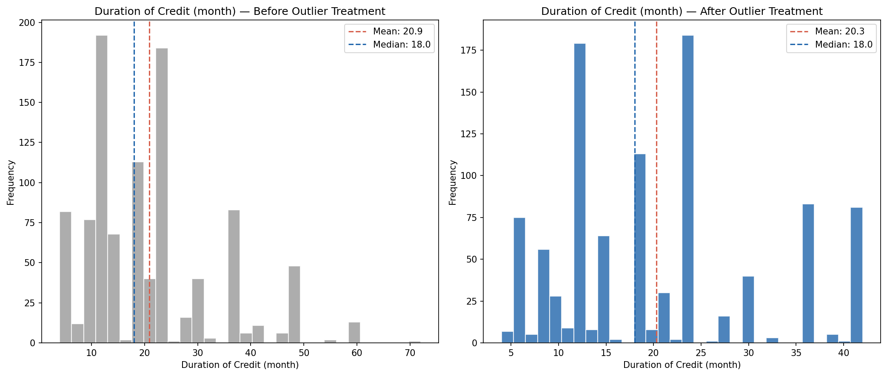

The Credit Amount distribution follows a similar pattern, with its right tail compressed from 18,424 to 7,882 while preserving the core shape. Both distributions retain their rank ordering after capping. The right tails are compressed but the variables' rank ordering is preserved, which is what matters for WoE-based modelling: the binning step will group these values into discrete risk categories, so the exact magnitude of extreme values is less important than their relative position.

With outliers capped and the dataset's 1,000 observations intact, we now examine each variable's individual relationship with default risk.

# Bivariate Analysis

Each of the 20 candidate variables was subjected to optimal binning using the OptimalBinning algorithm with constraint-programming solvers and explicit monotonicity enforcement. For ordinal and continuous variables, either ascending or descending monotonic trends were specified based on the expected economic direction of the risk relationship. Nominal categoricals were binned without monotonicity constraints. Variables with special codes (e.g., "no checking account" for Account Balance, coded as 4) had those codes isolated into dedicated bins via the `special_codes` parameter, ensuring that off-scale values received their own risk assessment while the remaining ordinal values maintained monotonicity. The IV threshold for shortlisting was set at 0.10, corresponding to the boundary between "weak" and "medium" predictive power.

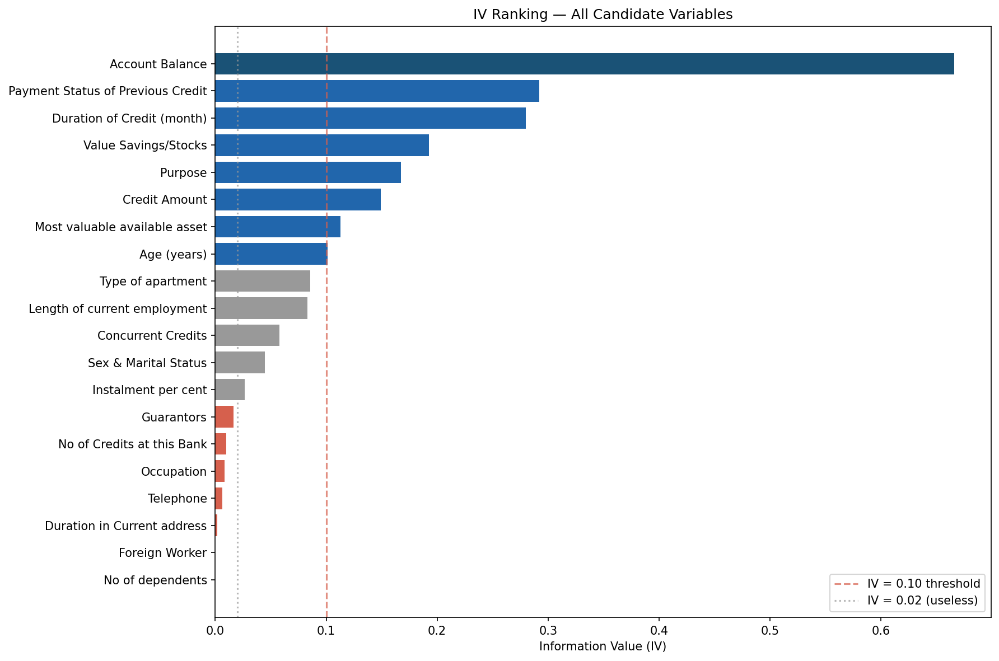

The IV landscape reveals a clear hierarchy. One variable stands out as dominant: Account Balance (IV = 0.67), which is flagged as suspicious because any IV above 0.50 may indicate information leakage or an overly direct proxy for the target. In this case, the high IV is economically justified -- checking account status is one of the strongest known predictors of retail default risk, and the German Credit dataset is known for this characteristic. The variable was retained after review. Below Account Balance, a cluster of three medium-to-strong predictors emerges: Payment Status of Previous Credit (IV = 0.29), Duration of Credit (IV = 0.28), and Value Savings/Stocks (IV = 0.19). Four additional variables clear the 0.10 threshold: Purpose (0.17), Credit Amount (0.15), Most Valuable Available Asset (0.11), and Age (0.10). The remaining 12 variables fall below the threshold, with IV values declining from 0.085 (Type of Apartment) to effectively zero (Foreign Worker, No of Dependents).

Predictive power is somewhat concentrated in Account Balance, which contributes roughly one-third of the total IV across shortlisted variables. This is a model risk consideration: the scorecard will be sensitive to changes in account balance data quality. However, the remaining seven variables collectively provide substantial diversification, and the model is not a single-variable scorecard. The 8-variable shortlist represents a good balance between discriminatory power and model parsimony.

| Variable | IV | Bins | WoE Direction | Economic Interpretation |
|---|---|---|---|---|
| Account Balance | 0.667 | 3 + special | Descending | Higher balances signal financial stability and lower default risk |
| Payment Status of Previous Credit | 0.292 | 4 | Categorical | Borrowers who fully repaid previous credits default far less often |
| Duration of Credit (month) | 0.280 | 7 | Ascending | Longer loan terms increase exposure time and default probability |
| Value Savings/Stocks | 0.193 | 3 + special | Descending | Larger savings provide a buffer against financial distress |
| Purpose | 0.168 | 6 | Categorical | Certain loan purposes (used car, retraining) carry higher risk |
| Credit Amount | 0.149 | 5 | Ascending | Larger loans are harder to repay and default more often |
| Most Valuable Available Asset | 0.113 | 3 + special | Ascending | Borrowers with fewer tangible assets are higher risk |
| Age (years) | 0.101 | 4 | Descending | Older borrowers have more stable finances and lower default risk |

Account Balance, the strongest predictor, demonstrates a textbook descending WoE pattern. Borrowers with the lowest account balances (bin 1) carry strongly negative WoE, indicating elevated default risk, while those with higher balances show progressively positive WoE. The special code bin -- representing borrowers with no checking account -- carries the highest positive WoE (1.18), meaning these borrowers actually default less frequently than those with low-balance accounts. This is a known feature of the German Credit dataset: "no checking account" does not mean financial exclusion but rather that the borrower banks elsewhere.

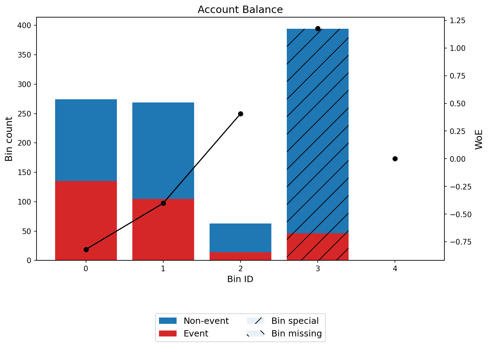

Duration of Credit provides an instructive contrast. Its ascending WoE pattern shows that very short loans (under 8.5 months) have the most positive WoE (1.28), indicating the lowest default risk, while loans exceeding 39.5 months carry strongly negative WoE (-0.99). This 7-bin profile captures a nuanced risk gradient that a simpler binning scheme would miss.

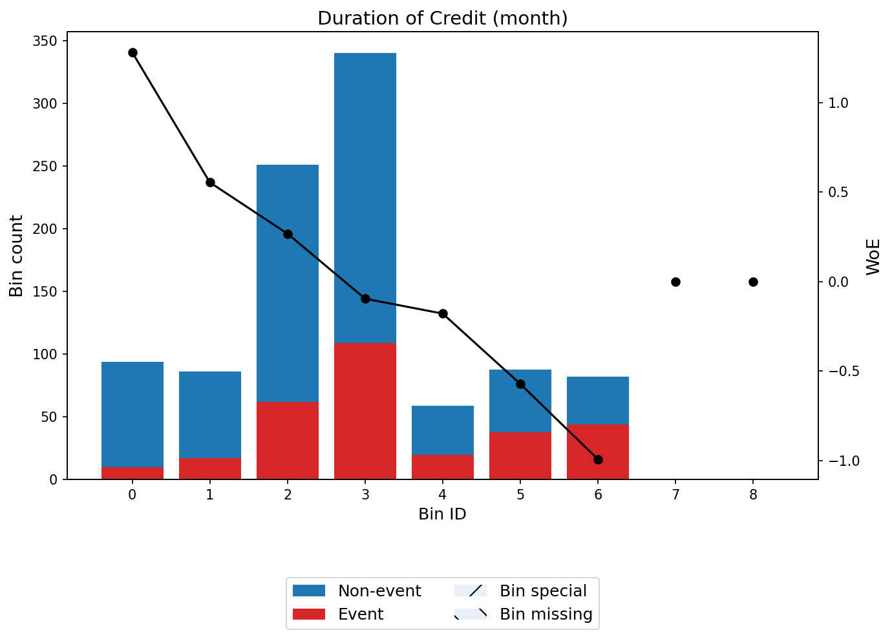

Age is the weakest shortlisted variable (IV = 0.10), sitting right at the inclusion threshold. Its descending WoE pattern shows that borrowers under 25.5 years carry notably higher risk (WoE = -0.53) than those over 34.5 (WoE = +0.31), which is economically intuitive -- younger borrowers have shorter credit histories and less stable income.

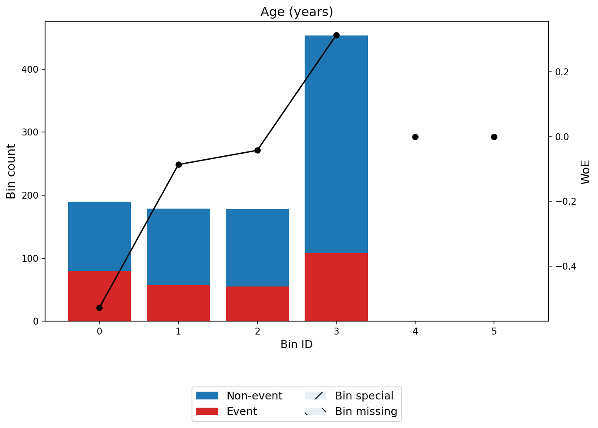

The remaining five shortlisted variables -- Payment Status of Previous Credit, Value Savings/Stocks, Purpose, Credit Amount, and Most Valuable Available Asset -- all show WoE patterns consistent with economic expectations. Their monotonicity was confirmed by the OptimalBinning solver in all cases (status: OPTIMAL), and their profiles are included in Appendix C. No correlation clusters were detected among the shortlisted variables (no pairs with |WoE correlation| > 0.7), which means all eight can enter the multivariate model without multicollinearity concerns.

These 8 variables form the candidate pool for model building. The next step tests whether they work together in a multivariate framework.

# Model Building

To stress-test the robustness of variable selection, three independent methods were applied in parallel to the same pool of 8 shortlisted variables: Marginal Information Value (MIV) stepwise selection, XGBoost feature importance ranking with a 90% cumulative threshold, and forward stepwise regression with a 5% significance threshold. Using multiple selection methods is a regulatory best practice -- it demonstrates that the final variable set is not an artefact of any single algorithm but reflects genuine predictive structure in the data.

The result is striking: all three methods converged on essentially the same model. MIV stepwise and forward stepwise selected the identical 8 variables and produced logistic regressions with matching coefficients to six decimal places -- the two methods are mathematically different (MIV uses marginal information value as its entrance criterion; forward stepwise uses the likelihood ratio test) yet arrived at the same answer. XGBoost importance selected 7 of the 8 variables, excluding only Credit Amount, which fell just below the 90% cumulative importance threshold at 96.9% cumulative. The AUC difference between the 8-variable and 7-variable models is a negligible 0.0039 (0.8109 vs 0.807). This near-total convergence is strong evidence that the selected predictors capture the dataset's genuine risk structure.

| Metric | MIV Stepwise | XGBoost | Forward Stepwise |
|---|---|---|---|
| Variables | 8 | 7 | 8 |
| AUC | 0.8109 | 0.8070 | 0.8109 |
| Gini | 0.6218 | 0.6140 | 0.6218 |
| KS | 0.5067 | 0.4886 | 0.5067 |
| CV AUC Gap | 0.0044 | 0.0049 | 0.0044 |

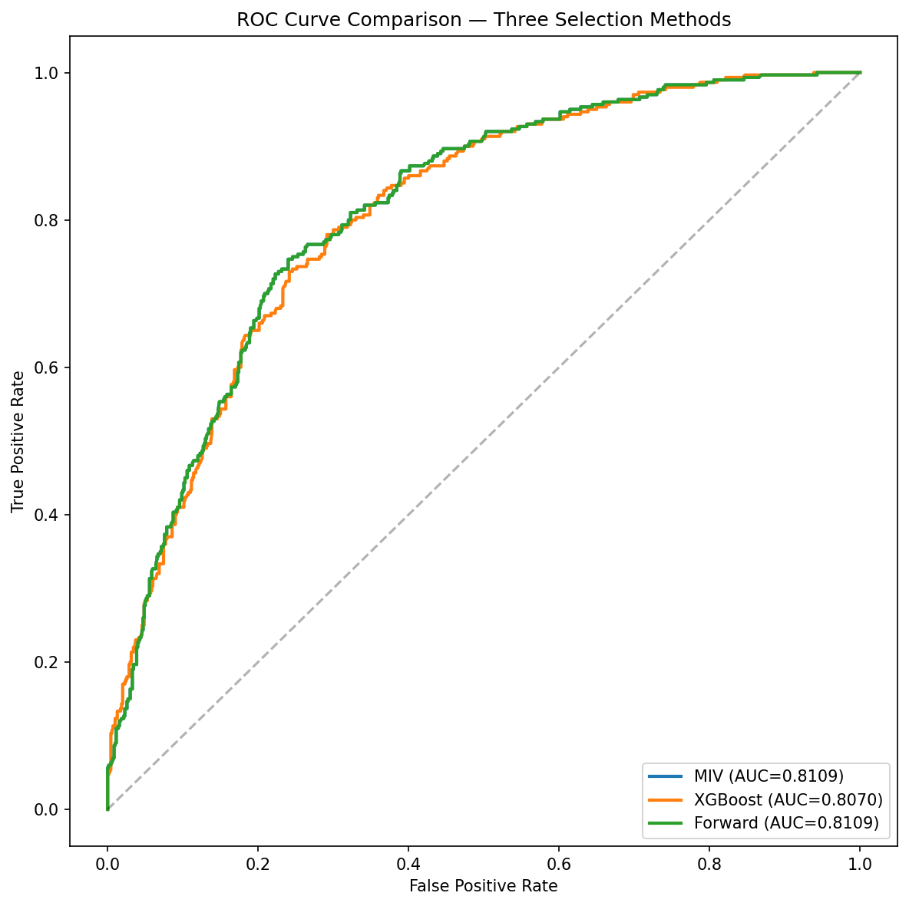

The ROC overlay confirms visually what the metrics show numerically: the three curves are virtually indistinguishable. The XGBoost model's slight shortfall is entirely attributable to the exclusion of Credit Amount, the weakest retained variable (IV = 0.15, entry p-value = 0.03 in forward stepwise).

The MIV model was selected as champion by convention -- it is the first among equal-scoring methods (composite score 0.9207 for both MIV and forward stepwise). This is a tiebreaker, not a substantive selection, since the two models are identical in every parameter.

## Champion Model Detail

The champion model fits 8 WoE-coded predictors via logistic regression on 1,000 observations. The model converged successfully with a pseudo R-squared of 0.2222, which is excellent for a logistic regression PD model -- values in the 0.20-0.40 range indicate strong explanatory power. The likelihood ratio test is highly significant (p < 10^-54), confirming that the model explains substantially more variance than a null intercept-only model.

| Variable | Coefficient | p-value |
|---|---|---|
| Purpose | -1.0367 | < 0.0001 |
| Age (years) | -0.8916 | 0.0005 |
| Account Balance | -0.7848 | < 0.0001 |
| Value Savings/Stocks | -0.7488 | 0.0002 |
| Payment Status of Previous Credit | -0.7257 | < 0.0001 |
| Duration of Credit (month) | -0.7160 | 0.0001 |
| Most valuable available asset | -0.5853 | 0.0230 |
| Credit Amount | -0.5164 | 0.0307 |

All eight coefficients are negative, which is the expected direction under the pdtoolkit WoE convention where WoE = ln(distribution of non-defaults / distribution of defaults). Positive WoE values indicate lower risk, so negative coefficients correctly predict lower probability of default (target = 1) for borrowers with higher WoE values. Purpose carries the largest absolute coefficient (-1.04), meaning that the type of loan has the strongest marginal impact on default probability after controlling for other factors. Age (-0.89) and Account Balance (-0.78) follow closely. Credit Amount and Most Valuable Available Asset have the smallest coefficients and the only p-values above 0.01, though both remain significant at the 5% level.

Multicollinearity is absent. The variance inflation factors for all eight variables range from 1.03 (Purpose) to 1.38 (Credit Amount), all well below the conventional concern threshold of 5.0 and even below the stricter 2.0 threshold sometimes applied in PD modelling. This means the coefficient estimates are stable, and the model can be maintained variable-by-variable without cascading effects from correlated predictors. The full coefficient table with standard errors, confidence intervals, and VIF values is provided in Appendix B.

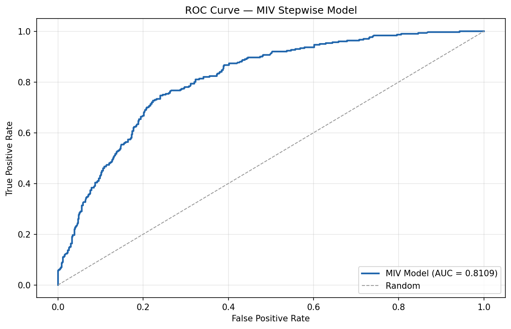

The AUC of 0.8109 places the model firmly in the "strong" discrimination tier. For context, retail PD models typically achieve AUCs in the 0.70-0.85 range, and the EBA benchmark for acceptable Gini coefficients is 0.35 -- this model's Gini of 0.6218 substantially exceeds that threshold. Cross-validation confirms stability: the 10-fold CV AUC of 0.8065 differs from the development AUC by only 0.0044, and bootstrap validation (0.8026) shows a similarly small gap of 0.0083. There is no evidence of overfitting.

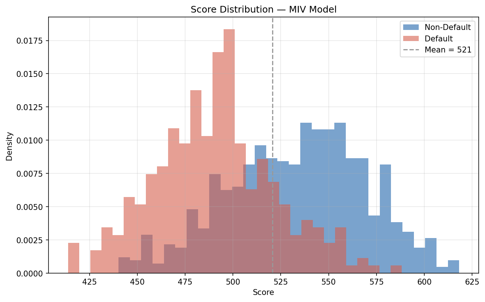

The score distribution spans 413.8 to 618.3 points, centred at a mean of 520.7. The distribution shows good separation between defaulters and non-defaulters, with no borrowers falling below 400 or above 800 -- the entire portfolio is well within the target score range. Score monotonicity across deciles is confirmed, meaning that higher-scoring borrowers consistently default at lower rates throughout the score range.

The model's statistical properties are sound. We now translate it into a usable scorecard and calibrate the PDs to a through-the-cycle central tendency.

# Scorecard

The logistic regression model is translated into a points-based scorecard where each borrower receives a total score equal to a base score plus the sum of points earned on each variable. Higher scores indicate lower default risk. The scorecard uses a standard parametrisation aligned with industry convention.

| Parameter | Value | Meaning |
|---|---|---|
| Base Score | 600 | Score at 50:1 odds of non-default |
| PDO | 20 | Each 20-point increase doubles the odds of repaying |
| Score Range | 413.8 -- 618.3 | Lowest to highest observed score |

In practical terms, a borrower scoring 620 has twice the odds of repaying compared to a borrower scoring 600, and four times the odds of a borrower scoring 580. The score scale is linear in log-odds, which means equal point differences correspond to equal multiplicative changes in risk.

Purpose contributes the widest point spread across its bins (approximately 40 points between safest and riskiest loan types), making it the single most influential variable in determining a borrower's final score. Account Balance and Duration of Credit follow closely, each contributing roughly 30-45 points of spread. At the other end, Most Valuable Available Asset contributes the narrowest range (approximately 18 points), consistent with its lower coefficient magnitude. The detailed points-per-bin allocation is provided in Appendix B.

| Variable | Point Spread (approx.) |
|---|---|
| Duration of Credit (month) | 47 |
| Account Balance | 45 |
| Purpose | 42 |
| Payment Status of Previous Credit | 41 |
| Value Savings/Stocks | 25 |
| Age (years) | 22 |
| Credit Amount | 20 |
| Most valuable available asset | 18 |

With the scorecard defined, we calibrate the model's raw probabilities to a through-the-cycle central tendency and assign borrowers to risk grades.

# Calibration

Regulatory PD models require calibration to a through-the-cycle (TTC) central tendency (CT) that reflects the expected long-run average default rate, rather than the point-in-time estimate from a single development sample. For this model, the central tendency was set at 30.0%, equal to the in-sample observed default rate. A scaling calibration method was applied to the model-predicted PDs (not observed default rates, which would create a circular calibration). The scaling factor of 1.0000 confirms that the model's aggregate predicted default rate already matches the target CT, so the calibration preserves the model's relative risk ranking while anchoring it to the chosen central tendency.

The calibrated PDs were mapped to an 8-grade rating scale using equal-frequency assignment (125 obligors per grade).

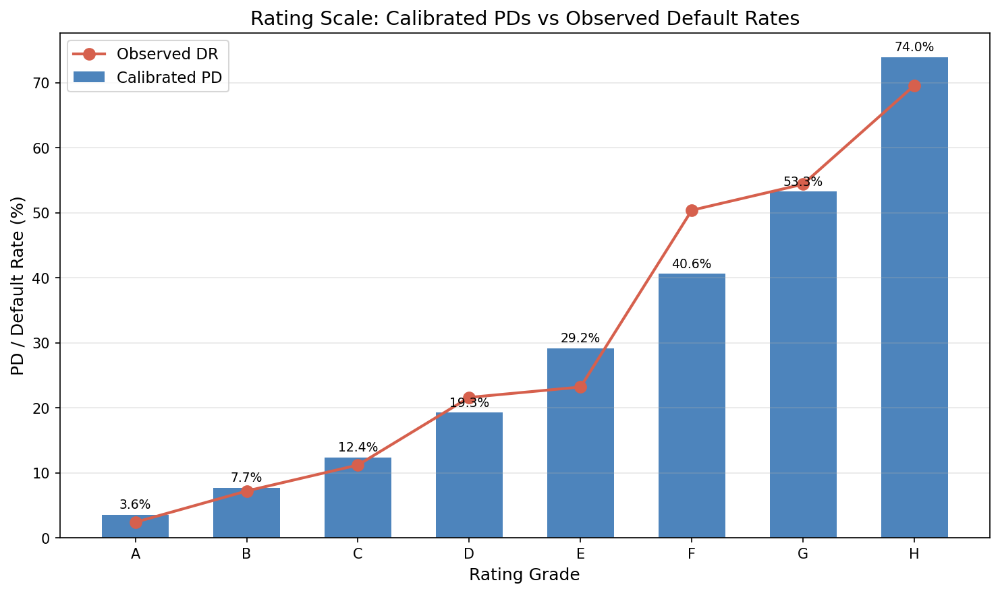

The calibrated PDs span a wide range from 3.6% (Grade A) to 74.0% (Grade H), providing strong risk differentiation across the portfolio. Grade-to-grade PD monotonicity is confirmed -- every grade carries a higher calibrated PD than the grade above it, with no inversions. The grade distribution is uniform by design (equal-frequency), with each grade containing exactly 12.5% of the portfolio. The Herfindahl-Hirschman Index of 0.125 confirms perfect balance, which means no grade is under-populated and all statistical tests have adequate sample sizes.

| Grade | Calibrated PD | Obligors | % Portfolio |
|---|---|---|---|
| A | 3.6% | 125 | 12.5% |
| B | 7.7% | 125 | 12.5% |
| C | 12.4% | 125 | 12.5% |
| D | 19.3% | 125 | 12.5% |
| E | 29.2% | 125 | 12.5% |
| F | 40.6% | 125 | 12.5% |
| G | 53.3% | 125 | 12.5% |
| H | 74.0% | 125 | 12.5% |

Calibration quality checks all pass: PDs are strictly monotonic across grades, the weighted average PD equals the target CT of 30.0%, the PD floor exceeds the regulatory minimum of 0.03%, and all grades contain sufficient observations. The normal test confirms that calibrated PDs are not systematically exceeded by observed defaults (p = 0.50). Importantly, the calibration operates on model-predicted probabilities, not observed default rates -- this avoids the circular calibration problem where the model would simply reproduce in-sample defaults rather than generating genuinely predictive PD estimates.

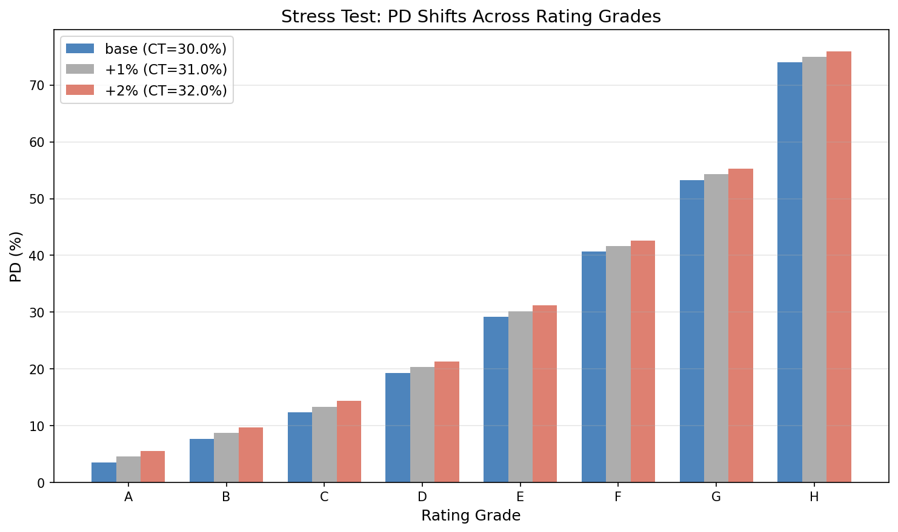

Under a +1 percentage point stress scenario (CT = 31.0%), the grade PDs shift upward proportionally, with the lowest-risk grades absorbing most of the relative increase while the highest-risk Grade H approaches but does not reach the 100% PD cap. Under +2 points (CT = 32.0%), the scale remains functional with all grades producing valid PDs. The rating scale is resilient under moderate stress, which is important for capital planning under ICAAP adverse scenarios.

The calibrated rating scale meets all quality criteria. The final step is formal validation: does the model perform well enough for regulatory acceptance?

# Validation

The model underwent a comprehensive validation programme covering five categories: discriminatory power (can the model distinguish defaulters from non-defaulters?), predictive power (are the calibrated PDs accurate at each grade level?), homogeneity (is default risk consistent within each grade?), heterogeneity (are default rates properly ordered across grades?), and stability (is the score distribution robust across subsamples?).

| Category | Key Metric | Result | Status |
|---|---|---|---|
| Discrimination | AUC = 0.8109 | Strong | PASS |
| Discrimination | KS = 0.5067 | Strong separation | PASS |
| Calibration | Hosmer-Lemeshow p = 0.294 | Well calibrated | PASS |
| Predictive Power | Binomial (8 grades) | 7/8 pass | FLAG |
| Homogeneity | Chi-square p = 0.393 | Homogeneous | PASS |
| Heterogeneity | p < 0.001 | Properly ordered | PASS |
| Stability | PSI = 0.045 | Stable | PASS |
| Cross-validation | CV AUC = 0.8065 | No overfitting | PASS |

Discriminatory power is the model's strongest suit. The AUC of 0.8109 is statistically significant against a null hypothesis of no discrimination (p = 2.5 x 10^-11), and the Gini coefficient of 0.6218 substantially exceeds the EBA's 0.35 benchmark. Stability testing confirms that discrimination is robust: splitting the sample in half produces AUCs of 0.8236 and 0.7950, a difference of 0.029 that is well within the 0.05 tolerance for sample-split stability.

Predictive power is strong overall but carries one flag. The Hosmer-Lemeshow test passes (p = 0.294), confirming that calibrated PDs are accurate in aggregate. At the grade level, 7 of 8 grades pass both binomial and Jeffreys predictive power tests. The exception is Grade F, where the observed default rate of 49.6% exceeds the calibrated PD of 40.6% (binomial p = 0.026, Jeffreys p = 0.021). This failure is isolated and marginal -- it reflects a local calibration issue in a narrow 13-point score band (491.6-504.9) rather than a systematic model deficiency. The root cause is the equal-frequency grading methodology, which does not respect natural risk clustering. Adjusting grade boundaries or testing with 7 or 9 grades would likely resolve this finding.

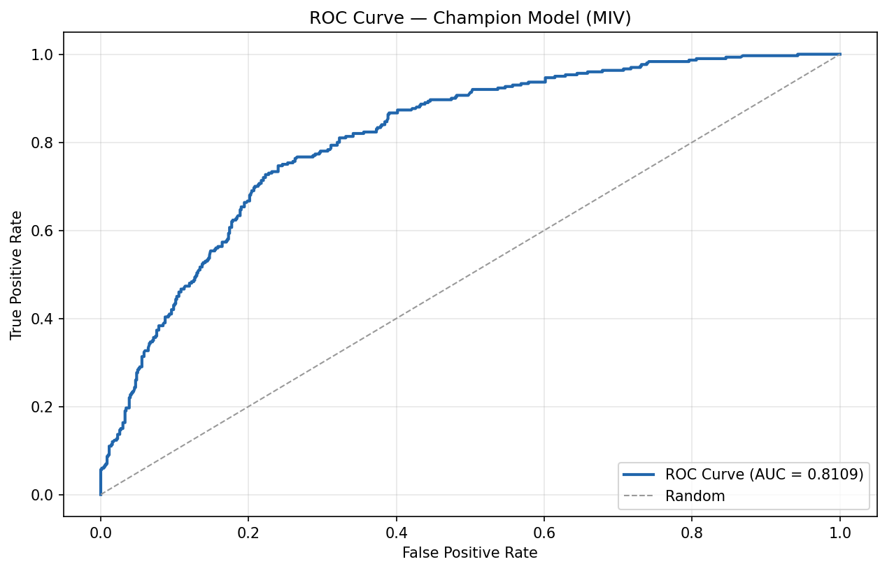

The validation ROC curve confirms the development-sample result. The curve hugs the upper-left corner of the plot, indicating strong discrimination across the full score range with no weak regions where the model approaches random performance.

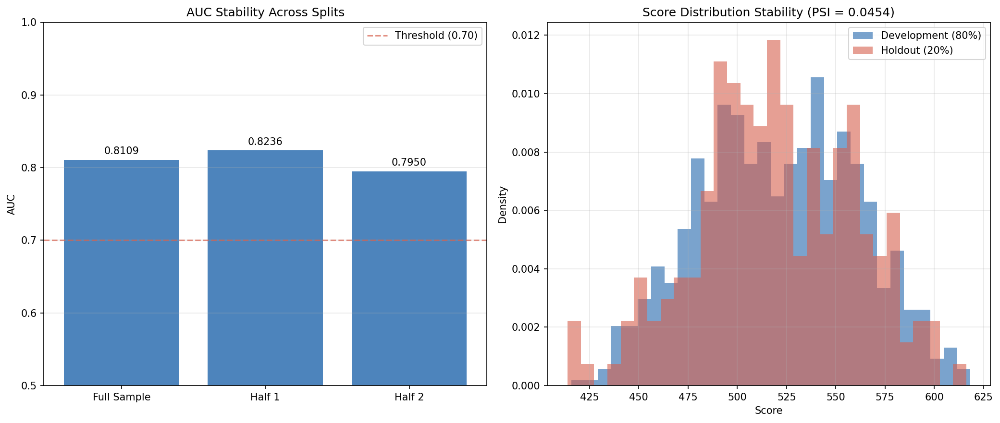

The PSI of 0.045 is well below the 0.10 monitoring threshold and far below the 0.25 action threshold, confirming that the score distribution is stable across random sample splits. This is expected for a development-sample assessment but provides a baseline for future out-of-time monitoring.

> **Overall Validation Assessment: PASS WITH FLAGS**
>
> The model demonstrates strong discriminatory power, stable performance, and well-calibrated PDs at the aggregate level. One grade-level predictive power test fails marginally (Grade F, p = 0.026). This is an isolated finding that does not compromise the model's overall fitness for purpose but should be documented for regulatory disclosure and addressed through grade boundary optimisation before production deployment.

# Conclusions and Recommendations

A PD model was developed on the German Credit dataset using a WoE logistic regression framework with 8 predictor variables selected from an initial pool of 20 candidates. The central finding of this development exercise is the remarkable convergence of three independent variable selection methods on essentially the same model, which provides unusually strong evidence that the selected feature set captures the dataset's genuine risk structure.

The model's strongest quality is the robustness of its variable selection. Three methodologically distinct approaches -- MIV stepwise, XGBoost importance, and forward stepwise -- converged on the same eight predictors, virtually eliminating the risk that the feature set is an artefact of any single methodology. Beyond variable selection, the model exhibits strong discriminatory power (AUC = 0.81, exceeding most retail PD benchmarks), no evidence of overfitting (CV AUC gap of 0.004), and clean multicollinearity diagnostics (all VIF < 1.4). The calibrated rating scale achieves its target central tendency with strictly monotonic PDs across all eight grades and passes aggregate goodness-of-fit testing.

The model's principal limitation is the absence of out-of-time (OOT) validation, which means temporal stability has not been demonstrated. The sample size of 1,000 observations, while adequate for an 8-variable logistic regression, limits the statistical power of grade-level tests -- the Grade F predictive power failure (p = 0.026) may partly reflect small within-grade samples (n = 125) rather than a genuine calibration deficiency. Additionally, Account Balance dominates the model with an IV of 0.67, accounting for roughly a third of total predictive power. While this concentration is economically justified, it creates sensitivity to changes in account balance data quality or business practices that should be monitored.

The model is recommended for deployment subject to three conditions. First, Grade F boundaries should be reviewed -- testing with natural-break grading or alternative grade counts (7 or 9) may resolve the predictive power failure without re-developing the model. Second, out-of-time validation should be performed when a subsequent observation period becomes available, with particular attention to PSI trends and grade-level calibration stability. Third, the central tendency should be reviewed annually against realised portfolio default rates, with re-calibration triggered if cumulative observed defaults diverge from the CT by more than 2 percentage points.

# Regulatory Flags

| Source | Flag | Severity | Assessment |
|---|---|---|---|
| Stage 01 | Foreign Worker near-zero variance (96.3% single category) | Info | Excluded in bivariate analysis (IV = 0.0). No impact on model. |
| Stage 03 | Account Balance IV = 0.67 (exceeds 0.50 suspicious threshold) | Warning | Retained after review -- high IV is economically justified for checking account status. |
| Stage 04x | MIV and Forward Stepwise produced identical models | Info | Expected when both thresholds admit the same variables. Documented for audit trail. |
| Stage 06 | Grade F binomial test FAIL (p = 0.026) | Warning | Isolated to one grade. Hosmer-Lemeshow overall passes. Recommend grade boundary review. |

The flags do not form a concerning pattern. The two informational flags (near-zero variance variable excluded, identical models from two methods) are benign audit trail entries. The two warning-level flags are unrelated: one concerns a single input variable's high univariate predictive power (retained with justification), and the other concerns a single grade's local calibration (addressable through boundary adjustment). Neither flag individually or collectively should block deployment. Both warning-level flags should be included in the model's regulatory documentation and monitored during the first year of production use.

# Pipeline Diagnostics

The automated pipeline identified 4 diagnostic issues across 9 stages, none at critical severity.

| Stage | Issue | Severity | Category |
|---|---|---|---|
| 03 | CP solver ortools incompatibility (ascending monotonicity) | Warning | Environment |
| 04c | `step_fwd()` sign convention incompatible with target encoding | Warning | Prompt/Agent |
| 04x | Min-max normalization over-penalizes XGBoost with narrow metric spread | Info | Methodology |
| 06 | Grade F predictive power failure | Warning | Calibration |

Five stages (01, 02, 04a, 04b, 05) completed with no diagnostic issues. The CP solver issue in Stage 03 was automatically mitigated by falling back to the MIP solver, which produces equivalent results. The `step_fwd()` sign convention issue in Stage 04c was handled by implementing a manual forward stepwise loop -- the resulting model matches the MIV model exactly, confirming the workaround was successful. The min-max normalization concern in Stage 04x is cosmetic: it affected composite scores but not champion selection (the correct model was chosen regardless). The Grade F issue is discussed in detail in the Validation chapter. The pipeline's overall health is good, with all issues either auto-mitigated or flagged for human review without blocking execution.

\newpage

# Appendix A: Methodology

**Weight of Evidence (WoE) and Information Value (IV).** WoE measures the relative risk of each bin within a variable, calculated as ln(distribution of non-defaults / distribution of defaults). Positive WoE indicates lower-than-average risk; negative WoE indicates higher-than-average risk. IV aggregates the WoE across bins to quantify a variable's overall predictive power, with thresholds of < 0.02 (useless), 0.02-0.10 (weak), 0.10-0.30 (medium), and > 0.30 (strong). Bins were constructed using the OptimalBinning algorithm with constraint-programming solvers, enforcing monotonic WoE trends for ordinal variables and minimum bin sizes of 5%.

**Variable selection methods.** MIV stepwise enters variables one at a time based on their marginal information value contribution, testing each addition with a marginal chi-square test (threshold: p < 0.05). XGBoost importance fits a gradient-boosted tree ensemble and ranks variables by information gain, selecting those contributing to the top 90% of cumulative importance. Forward stepwise adds variables in order of their likelihood ratio test contribution (threshold: p < 0.05).

**Model comparison.** The three methods' logistic regression outputs were compared on AUC, Gini, KS, pseudo R-squared, and cross-validation stability, combined into a composite score using min-max normalization with equal weights.

**Score scaling.** Scores are calculated as: Score = Offset - Factor x ln(Odds), where Offset = Base Score + PDO/ln(2) x ln(Base Odds) and Factor = PDO/ln(2). With Base Score = 600, PDO = 20, and Base Odds = 50:1.

**Calibration.** The scaling method adjusts model-predicted PDs to achieve a target central tendency while preserving rank ordering. The scaling factor is the ratio of target CT to the weighted average model PD.

**Validation tests.** Discriminatory power: AUC significance test (DeLong). Predictive power: Hosmer-Lemeshow (overall), binomial and Jeffreys tests (per grade). Homogeneity: chi-square test of within-grade default rate consistency (p > 0.05 = pass). Heterogeneity: test of monotonic default rate ordering across grades. Stability: PSI (< 0.10 = stable, 0.10-0.25 = monitor, > 0.25 = action required).

# Appendix B: Model Parameters (Full Detail)

**Full coefficient table -- champion model (MIV)**

| Variable | Coefficient | Std Error | z-statistic | p-value | 95% CI Lower | 95% CI Upper | VIF |
|---|---|---|---|---|---|---|---|
| Intercept | -0.8475 | 0.0822 | -10.315 | < 0.0001 | -1.009 | -0.687 | -- |
| Account Balance | -0.7848 | 0.1033 | -7.594 | < 0.0001 | -0.987 | -0.582 | 1.15 |
| Payment Status of Previous Credit | -0.7257 | 0.1520 | -4.776 | < 0.0001 | -1.024 | -0.428 | 1.07 |
| Duration of Credit (month) | -0.7160 | 0.1783 | -4.015 | 0.0001 | -1.066 | -0.366 | 1.37 |
| Value Savings/Stocks | -0.7488 | 0.1978 | -3.786 | 0.0002 | -1.137 | -0.361 | 1.08 |
| Purpose | -1.0367 | 0.2024 | -5.121 | < 0.0001 | -1.434 | -0.640 | 1.03 |
| Credit Amount | -0.5164 | 0.2390 | -2.161 | 0.0307 | -0.985 | -0.048 | 1.38 |
| Most valuable available asset | -0.5853 | 0.2575 | -2.273 | 0.0230 | -1.090 | -0.081 | 1.14 |
| Age (years) | -0.8916 | 0.2554 | -3.491 | 0.0005 | -1.392 | -0.391 | 1.06 |

**Calibrated rating scale (full detail)**

| Grade | Score Range | Calibrated PD | Obligors | % Portfolio |
|---|---|---|---|---|
| A | 567.6 -- 618.3 | 3.56% | 125 | 12.5% |
| B | 551.5 -- 567.5 | 7.70% | 125 | 12.5% |
| C | 536.8 -- 551.4 | 12.37% | 125 | 12.5% |
| D | 520.3 -- 536.4 | 19.30% | 125 | 12.5% |
| E | 505.3 -- 520.3 | 29.19% | 125 | 12.5% |
| F | 491.6 -- 504.9 | 40.64% | 125 | 12.5% |
| G | 473.0 -- 491.5 | 53.26% | 125 | 12.5% |
| H | 413.8 -- 473.0 | 73.97% | 125 | 12.5% |

**Stress test detail**

| Grade | Base PD | CT +1pp (31%) | CT +2pp (32%) |
|---|---|---|---|
| A | 3.56% | 3.68% | 3.80% |
| B | 7.70% | 7.96% | 8.21% |
| C | 12.37% | 12.78% | 13.20% |
| D | 19.30% | 19.94% | 20.59% |
| E | 29.19% | 30.16% | 31.13% |
| F | 40.64% | 41.99% | 43.35% |
| G | 53.26% | 55.03% | 56.81% |
| H | 73.97% | 76.44% | 78.90% |

**Scorecard points allocation (consolidated)**

| Variable | Bin | WoE | Points |
|---|---|---|---|
| Account Balance | (-inf, 1.50) | -0.818 | -18.5 |
| Account Balance | Special (no checking) | 1.176 | 26.6 |
| Account Balance | [1.50, 2.50) | -0.401 | -9.1 |
| Account Balance | [2.50, inf) | 0.405 | 9.2 |
| Payment Status of Previous Credit | ['1' '0'] (critical/delay) | -1.234 | -25.8 |
| Payment Status of Previous Credit | ['2'] (other credits) | -0.088 | -1.8 |
| Payment Status of Previous Credit | ['3'] (no problems) | -0.085 | -1.8 |
| Payment Status of Previous Credit | ['4'] (fully repaid) | 0.734 | 15.4 |
| Duration of Credit (month) | (-inf, 8.50) | 1.281 | 26.4 |
| Duration of Credit (month) | [8.50, 11.50) | 0.554 | 11.4 |
| Duration of Credit (month) | [11.50, 15.50) | 0.267 | 5.5 |
| Duration of Credit (month) | [15.50, 26.50) | -0.096 | -2.0 |
| Duration of Credit (month) | [26.50, 34.50) | -0.179 | -3.7 |
| Duration of Credit (month) | [34.50, 39.50) | -0.573 | -11.8 |
| Duration of Credit (month) | [39.50, inf) | -0.994 | -20.5 |
| Value Savings/Stocks | (-inf, 1.50) | -0.271 | -5.9 |
| Value Savings/Stocks | Special (no savings) | 0.704 | 15.2 |
| Value Savings/Stocks | [1.50, 2.50) | -0.140 | -3.0 |
| Value Savings/Stocks | [2.50, inf) | 0.863 | 18.6 |
| Purpose | ['10' '6'] (others/education) | -0.588 | -17.6 |
| Purpose | ['5' '0'] (new car/vacation) | -0.353 | -10.6 |
| Purpose | ['9'] (business) | -0.231 | -6.9 |
| Purpose | ['2' '4'] (furniture/retraining) | -0.099 | -3.0 |
| Purpose | ['3'] (used car) | 0.410 | 12.3 |
| Purpose | ['8' '1'] (radio-TV/repairs) | 0.806 | 24.1 |
| Credit Amount | (-inf, 718) | 0.325 | 4.8 |
| Credit Amount | [718, 3909.50) | 0.213 | 3.2 |
| Credit Amount | [3909.50, 6322.50) | -0.336 | -5.0 |
| Credit Amount | [6322.50, 7839.50) | -0.355 | -5.3 |
| Credit Amount | [7839.50, inf) | -1.035 | -15.4 |
| Most valuable available asset | (-inf, 1.50) (real estate) | 0.461 | 7.8 |
| Most valuable available asset | [1.50, 2.50) (building soc.) | -0.029 | -0.5 |
| Most valuable available asset | [2.50, inf) (car/other) | -0.034 | -0.6 |
| Most valuable available asset | Special (no property) | -0.586 | -9.9 |
| Age (years) | (-inf, 25.50) | -0.529 | -13.6 |
| Age (years) | [25.50, 29.50) | -0.086 | -2.2 |
| Age (years) | [29.50, 34.50) | -0.042 | -1.1 |
| Age (years) | [34.50, inf) | 0.314 | 8.1 |

# Appendix C: Supplementary Charts

The following charts provide additional detail on shortlisted variables not shown in the main body. Each is included because a model reviewer would specifically look for these WoE profiles to verify economic plausibility.

Value Savings/Stocks shows a clean descending WoE pattern with a special-code bin for borrowers with no savings account. The special code carries a positive WoE of 0.70, indicating that -- similar to Account Balance -- the absence of a savings relationship at this bank does not necessarily indicate higher risk.

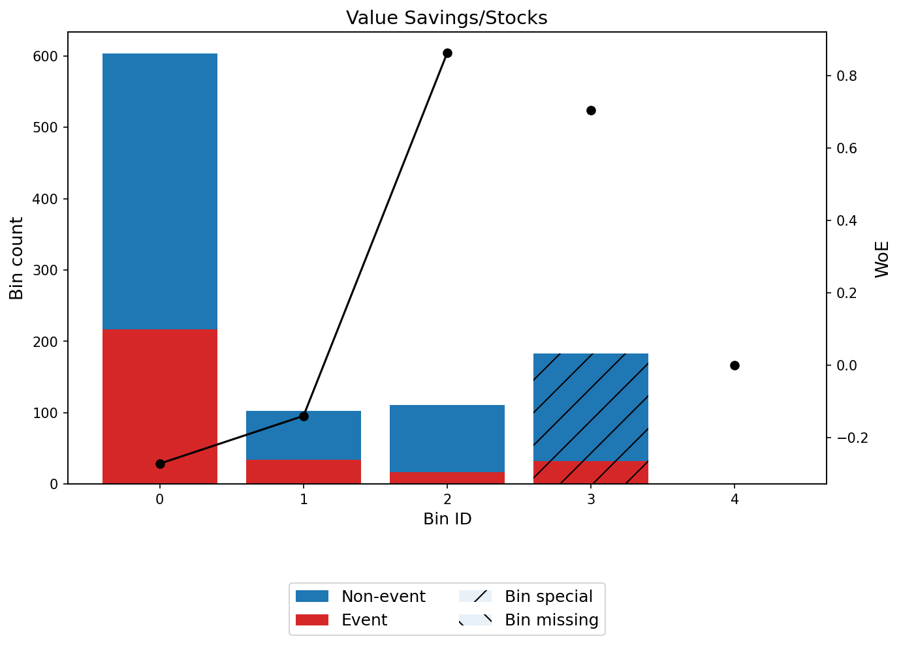

Credit Amount exhibits a monotonically ascending WoE profile, with the highest-value loans (over 7,840) carrying the most negative WoE (-1.03). The 5-bin structure captures a gradual risk gradient rather than a sharp threshold effect.

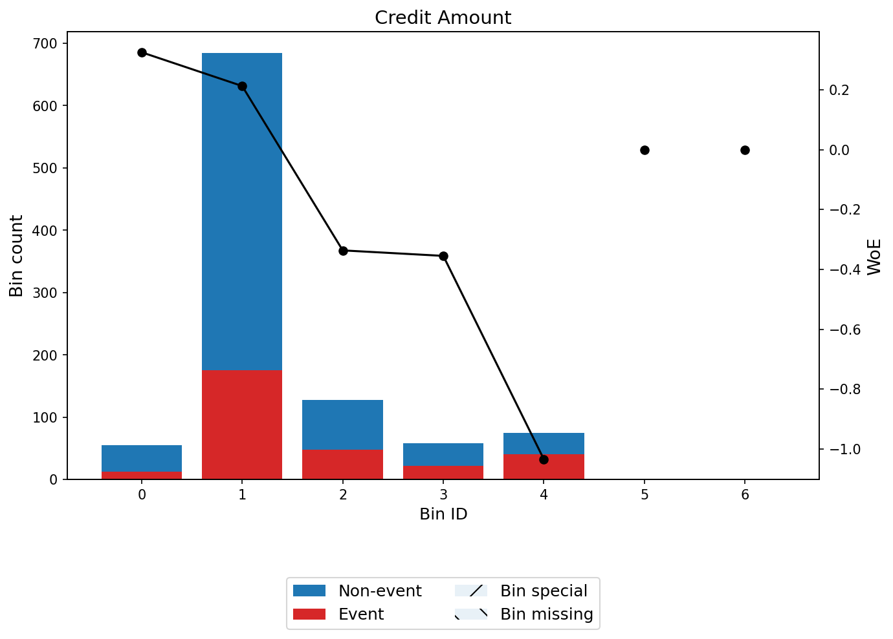

The champion model's score decile analysis confirms monotonic separation across the full score range, with the highest-scoring decile achieving a near-zero default rate and the lowest-scoring decile approaching the base rate.

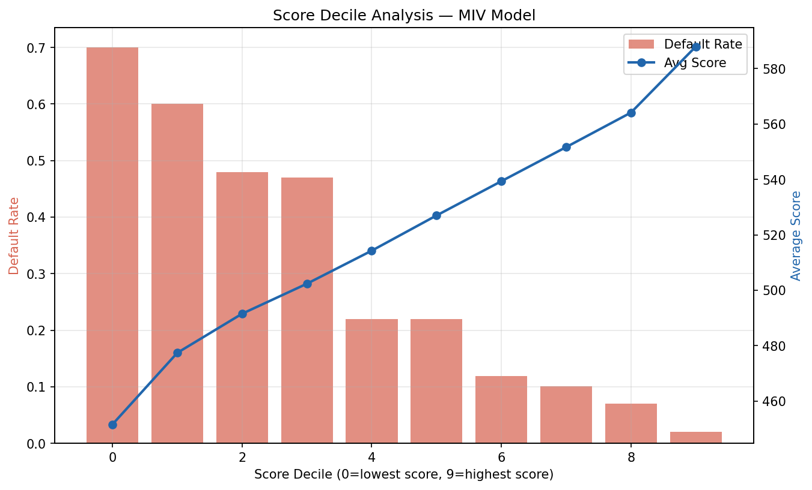

The predictive power test results by grade show that 7 of 8 grades comfortably pass, with Grade F as the sole exception. This chart visualises the relationship between calibrated PDs and observed default rates at each grade level.

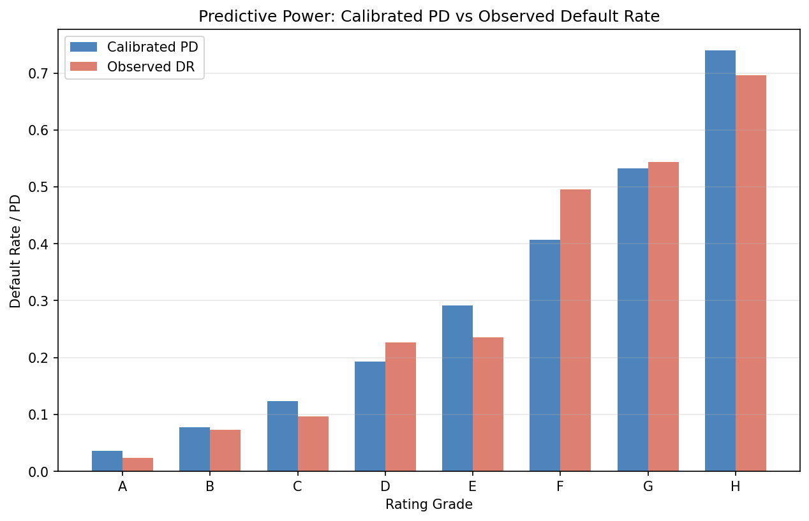

# Appendix D: Full Variable List

The table below tracks every candidate variable from initial screening through to final model inclusion, documenting the disposition decision at each stage.

| Variable | Type | Stage 02 Treatment | IV | Stage 03 Status | In Model |
|---|---|---|---|---|---|
| Account Balance | Ordinal | None | 0.667 | Shortlisted | Yes |
| Payment Status of Previous Credit | Nominal | None | 0.292 | Shortlisted | Yes |
| Duration of Credit (month) | Continuous | IQR cap (7.0%) | 0.280 | Shortlisted | Yes |
| Value Savings/Stocks | Ordinal | None | 0.193 | Shortlisted | Yes |
| Purpose | Nominal | None | 0.168 | Shortlisted | Yes |
| Credit Amount | Continuous | IQR cap (7.2%) | 0.149 | Shortlisted | Yes |
| Most valuable available asset | Ordinal | None | 0.113 | Shortlisted | Yes |
| Age (years) | Continuous | IQR cap (2.3%) | 0.101 | Shortlisted | Yes |
| Type of apartment | Nominal | None | 0.085 | Excluded (low IV) | No |
| Length of current employment | Ordinal | None | 0.083 | Excluded (low IV) | No |
| Concurrent Credits | Nominal | None | 0.058 | Excluded (low IV) | No |
| Sex & Marital Status | Nominal | None | 0.045 | Excluded (low IV) | No |
| Instalment per cent | Ordinal | None | 0.026 | Excluded (low IV) | No |
| Guarantors | Nominal | None | 0.016 | Excluded (low IV) | No |
| No of Credits at this Bank | Ordinal | None | 0.010 | Excluded (low IV) | No |
| Occupation | Ordinal | None | 0.008 | Excluded (low IV) | No |
| Telephone | Nominal | None | 0.006 | Excluded (low IV) | No |
| Duration in Current address | Ordinal | None | 0.002 | Excluded (low IV) | No |
| No of dependents | Ordinal | None | 0.000 | Excluded (low IV) | No |
| Foreign Worker | Nominal | None | 0.000 | Excluded (NZV + low IV) | No |
